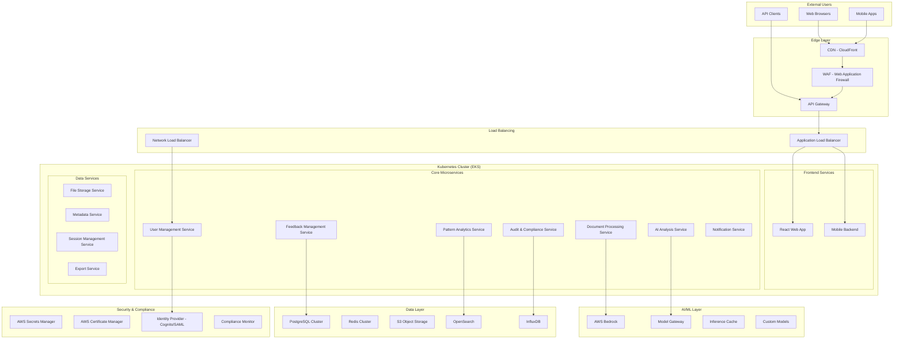

# 🏗️ TARA2 AI-Prism Enterprise Architecture & System Design Guide

## 📋 Executive Summary

TARA2 (AI-Prism) is a sophisticated document analysis tool leveraging AI for comprehensive investigation framework compliance. This guide outlines the transformation from the current prototype to an enterprise-grade, scalable solution capable of supporting thousands of concurrent users with enterprise security, compliance, and governance requirements.

**Current State**: Prototype Flask application with basic AWS integration
**Target State**: Cloud-native, microservices-based platform with enterprise features

---

## 🔍 Current System Analysis

### Current Architecture Components

**Backend Services**:
- [`app.py`](app.py:1) - Flask web application (2,120+ lines)
- [`core/document_analyzer.py`](core/document_analyzer.py:1) - Document processing engine
- [`core/ai_feedback_engine.py`](core/ai_feedback_engine.py:1) - AI integration with AWS Bedrock
- [`utils/statistics_manager.py`](utils/statistics_manager.py:1) - Analytics and reporting
- [`utils/s3_export_manager.py`](utils/s3_export_manager.py:1) - Cloud storage integration
- [`utils/activity_logger.py`](utils/activity_logger.py:1) - Comprehensive activity tracking
- [`utils/learning_system.py`](utils/learning_system.py:1) - AI learning adaptation
- [`utils/pattern_analyzer.py`](utils/pattern_analyzer.py:1) - Cross-document pattern recognition

**Frontend**:
- [`templates/enhanced_index.html`](templates/enhanced_index.html:1) - Responsive web interface (8,298 lines)
- Multiple JavaScript modules for interactivity
- Modern CSS with dark/light mode support
- Mobile-responsive design

**Current Technology Stack**:
- **Backend**: Python 3.11, Flask 2.3+, python-docx, boto3
- **AI Services**: AWS Bedrock (Claude 3.5/3.7 Sonnet)
- **Storage**: AWS S3, local file system
- **Deployment**: Docker, AWS App Runner
- **Frontend**: HTML5, CSS3, vanilla JavaScript

### Current Capabilities
- ✅ Document analysis with Hawkeye framework (20-point checklist)
- ✅ AI-powered feedback generation
- ✅ Interactive user feedback management
- ✅ Real-time chat with AI assistant
- ✅ Pattern recognition across multiple documents
- ✅ Comprehensive activity logging and audit trails
- ✅ Learning system that adapts to user preferences
- ✅ S3 export with complete backup capabilities
- ✅ Responsive web interface with accessibility features
- ✅ Session management and state persistence

---

## 🏗️ Enterprise-Level Technical Architecture

### 1. Cloud-Native Microservices Architecture



### 2. Service Architecture Breakdown

#### 2.1 Frontend Layer
- **Technology**: React 18+ with TypeScript
- **Features**: Progressive Web App (PWA), Server-Side Rendering (SSR)
- **Responsive**: Mobile-first design with adaptive UI
- **Authentication**: JWT-based with refresh tokens

#### 2.2 API Gateway & Edge Services
- **AWS API Gateway**: Rate limiting, request/response transformation
- **AWS CloudFront**: Global CDN with edge locations
- **AWS WAF**: DDoS protection, SQL injection prevention
- **Custom Rate Limiting**: Per-user, per-organization limits

#### 2.3 Core Microservices

**User Management Service**
- Multi-tenant user authentication and authorization
- Role-based access control (RBAC)
- Organization management
- User preferences and settings
- Integration with enterprise identity providers

**Document Processing Service**
- Asynchronous document processing
- Format support: .docx, .pdf, .txt, .rtf
- Version control and document history
- Collaborative editing support
- Document encryption at rest and in transit

**AI Analysis Service**
- Multi-model AI inference
- Intelligent model routing and fallback
- Response caching and optimization
- Custom model fine-tuning capabilities
- Batch processing for large document sets

**Feedback Management Service**
- Feedback lifecycle management
- Approval workflows
- Comment threading and collaboration
- Integration with document versioning
- Advanced search and filtering

**Pattern Analytics Service**
- Real-time pattern detection
- Machine learning for trend analysis
- Predictive analytics
- Custom dashboards and reports
- Data visualization and insights

**Audit & Compliance Service**
- Comprehensive audit logging
- Compliance reporting
- Data retention policies
- Security monitoring
- Regulatory compliance (GDPR, SOX, etc.)

---

## 🔧 Technology Stack Modernization

### Backend Technologies

**Core Framework**
- **Primary**: FastAPI with async/await for high performance
- **Alternative**: Node.js with Express for JavaScript ecosystem
- **Language**: Python 3.11+ or TypeScript/Node.js 18+

**Databases**
- **Primary Database**: PostgreSQL 15+ with read replicas
- **Cache Layer**: Redis 7+ with clustering
- **Search Engine**: OpenSearch/Elasticsearch
- **Time Series**: InfluxDB for metrics and monitoring
- **Document Store**: MongoDB for unstructured data

**Message Queue & Event Streaming**
- **Message Broker**: Apache Kafka for event streaming
- **Task Queue**: Celery with Redis/SQS backend
- **Real-time**: WebSocket support with Socket.IO

### Frontend Technologies

**Web Application**
- **Framework**: React 18+ with TypeScript
- **State Management**: Redux Toolkit or Zustand
- **UI Library**: Material-UI or Ant Design
- **Build Tool**: Vite or Webpack 5
- **Testing**: Jest, React Testing Library, Playwright

**Mobile Applications**
- **Cross-Platform**: React Native or Flutter
- **Native iOS**: Swift with SwiftUI
- **Native Android**: Kotlin with Jetpack Compose

### Infrastructure & DevOps

**Container Orchestration**
- **Primary**: Amazon EKS (Kubernetes)
- **Alternative**: AWS ECS with Fargate
- **Service Mesh**: Istio for advanced traffic management

**CI/CD Pipeline**
- **Source Control**: GitLab or GitHub Enterprise
- **CI/CD**: GitLab CI/CD or GitHub Actions
- **Artifact Registry**: AWS ECR or GitLab Container Registry
- **Security Scanning**: Snyk, SonarQube, Trivy

**Infrastructure as Code**
- **Primary**: AWS CDK (TypeScript/Python)
- **Alternative**: Terraform with AWS Provider
- **Configuration**: Helm charts for Kubernetes deployments

---

## 📊 Scalability & Performance Architecture

### 1. Horizontal Scaling Strategy

**Auto-Scaling Groups**
```yaml
Scaling Targets:
  - Web Tier: 3-50 instances
  - API Tier: 5-100 instances  
  - Worker Tier: 2-20 instances
  - AI Processing: 3-30 instances

Scaling Metrics:
  - CPU Utilization: 70% threshold
  - Memory Usage: 80% threshold
  - Request Rate: 1000 RPS per instance
  - Response Time: 200ms average
```

**Database Scaling**
- **Read Replicas**: 3-5 read replicas across AZ
- **Connection Pooling**: PgBouncer with 1000+ connections
- **Sharding Strategy**: By organization/tenant ID
- **Caching Layer**: Multi-level caching (L1: Application, L2: Redis)

### 2. Performance Optimization

**Caching Strategy**
```yaml
Cache Layers:
  L1 - Application Cache:
    - Technology: In-memory Python/Node.js cache
    - Duration: 5 minutes
    - Use Cases: User sessions, frequent queries
    
  L2 - Distributed Cache:
    - Technology: Redis Cluster
    - Duration: 1-24 hours
    - Use Cases: AI responses, document metadata
    
  L3 - CDN Cache:
    - Technology: CloudFront
    - Duration: 7 days
    - Use Cases: Static assets, API responses
```

**AI Optimization**
- **Model Response Caching**: Cache similar analysis requests
- **Batch Processing**: Group document analysis requests
- **Model Quantization**: Optimize model size and speed
- **Edge AI**: Deploy lightweight models at edge locations

### 3. Data Processing Pipeline

**Real-time Processing**
```yaml
Event Stream Architecture:
  Document Upload → Kafka → Processing Workers → AI Analysis → Results Store
  
Processing Stages:
  1. Document Validation & Sanitization
  2. Content Extraction & OCR
  3. Section Detection & Preprocessing  
  4. AI Analysis with Model Routing
  5. Post-processing & Quality Assurance
  6. Results Aggregation & Storage
```

**Batch Processing**
- **Framework**: Apache Airflow for workflow orchestration
- **Compute**: AWS Batch for large-scale processing
- **Scheduling**: Cron-based and event-driven scheduling
- **Resource Management**: Spot instances for cost optimization

---

## 🔒 Security & Compliance Framework

### 1. Enterprise Security Architecture

**Authentication & Authorization**
```yaml
Identity Management:
  Provider: AWS Cognito + SAML/OIDC integration
  MFA: Required for all users
  Session Management: JWT with 15-minute access tokens
  Refresh Tokens: 7-day expiry with rotation
  
Role-Based Access Control (RBAC):
  Roles:
    - System Admin: Full system access
    - Organization Admin: Org-level management
    - Team Lead: Team management and reporting
    - Analyst: Document analysis and review
    - Viewer: Read-only access to results
    
  Permissions Matrix:
    - Document Upload: Analyst+
    - AI Analysis: Analyst+
    - Report Export: Team Lead+
    - User Management: Org Admin+
    - System Configuration: System Admin
```

**Data Protection**
- **Encryption at Rest**: AES-256 for all data stores
- **Encryption in Transit**: TLS 1.3 for all communications
- **Key Management**: AWS KMS with automatic key rotation
- **Data Masking**: PII protection in logs and exports
- **Backup Encryption**: Separate encryption keys for backups

### 2. Compliance & Governance

**Regulatory Compliance**
```yaml
GDPR Compliance:
  - Data minimization and purpose limitation
  - Right to erasure implementation
  - Data portability features
  - Consent management system
  - Privacy by design architecture

SOC 2 Type II:
  - Security controls documentation
  - Availability monitoring
  - Processing integrity checks
  - Confidentiality measures
  - Privacy controls implementation

HIPAA (if applicable):
  - PHI identification and protection
  - Access controls and audit trails
  - Encryption requirements
  - Business associate agreements
```

**Data Governance**
- **Data Classification**: Public, Internal, Confidential, Restricted
- **Data Retention**: Automated policies with configurable periods
- **Data Lineage**: Complete tracking from ingestion to export
- **Access Auditing**: Real-time monitoring of data access
- **Data Quality**: Automated validation and quality checks

---

## 🚀 Cloud-Native Deployment Strategy

### 1. Multi-Region Architecture

**Primary Deployment (US-East-1)**
```yaml
Production Environment:
  Region: us-east-1
  Availability Zones: 3
  EKS Cluster: Production cluster with 20-100 nodes
  RDS: Multi-AZ PostgreSQL with read replicas
  ElastiCache: Redis cluster across AZ
  S3: Primary data storage with versioning
  
Disaster Recovery (US-West-2):
  Region: us-west-2
  RTO: 4 hours
  RPO: 1 hour
  Replication: Async replication of critical data
  Failover: Automated with Route 53 health checks
```

### 2. Container Orchestration

**Kubernetes Configuration**
```yaml
# Production EKS Cluster
apiVersion: eks.aws.amazon.com/v1
kind: Cluster
metadata:
  name: ai-prism-prod
spec:
  version: "1.28"
  region: us-east-1
  nodeGroups:
    - name: web-tier
      instanceTypes: [t3.medium, t3.large]
      minSize: 3
      maxSize: 20
      capacityType: ON_DEMAND
      
    - name: api-tier  
      instanceTypes: [c5.large, c5.xlarge]
      minSize: 5
      maxSize: 50
      capacityType: SPOT
      
    - name: ai-processing
      instanceTypes: [g4dn.xlarge, g4dn.2xlarge]
      minSize: 2
      maxSize: 10
      capacityType: ON_DEMAND
      
  addons:
    - aws-load-balancer-controller
    - cluster-autoscaler
    - aws-efs-csi-driver
    - ebs-csi-driver
```

**Service Mesh Configuration**
```yaml
# Istio Service Mesh
Traffic Management:
  - Intelligent routing based on request type
  - Canary deployments with automated rollback
  - Circuit breakers for fault tolerance
  - Rate limiting per service/user

Security:
  - mTLS for all inter-service communication
  - JWT validation at ingress
  - Network policies for micro-segmentation
  - Security scanning of container images
```

### 3. DevOps & CI/CD Pipeline

**GitOps Workflow**
```yaml
Development Workflow:
  1. Feature Branch → Code Review → Tests
  2. Merge to Main → Automated CI Pipeline
  3. Container Build → Security Scan → Registry Push
  4. Staging Deployment → Integration Tests
  5. Production Deployment → Health Checks
  
Pipeline Stages:
  - Code Quality: SonarQube, ESLint, Black
  - Security: Snyk, OWASP dependency check
  - Testing: Unit, Integration, E2E tests
  - Build: Multi-arch container builds
  - Deploy: Blue-green deployment strategy
```

**Infrastructure Management**
```typescript
// AWS CDK Stack Example
import * as aws from 'aws-cdk-lib';

export class AIPrismStack extends Stack {
  constructor(scope: Construct, id: string, props?: StackProps) {
    super(scope, id, props);
    
    // VPC with public/private subnets
    const vpc = new aws.ec2.Vpc(this, 'AIPrismVPC', {
      maxAzs: 3,
      natGateways: 3,
      enableDnsHostnames: true,
      enableDnsSupport: true
    });
    
    // EKS Cluster
    const cluster = new aws.eks.Cluster(this, 'AIPrismCluster', {
      vpc,
      version: KubernetesVersion.V1_28,
      defaultCapacity: 0, // We'll add node groups separately
    });
    
    // RDS Database
    const database = new aws.rds.DatabaseCluster(this, 'AIPrismDB', {
      engine: aws.rds.DatabaseClusterEngine.auroraPostgres({
        version: aws.rds.AuroraPostgresEngineVersion.VER_15_3
      }),
      credentials: aws.rds.Credentials.fromGeneratedSecret('postgres'),
      instanceProps: {
        instanceType: aws.ec2.InstanceType.of(
          aws.ec2.InstanceClass.R5, 
          aws.ec2.InstanceSize.LARGE
        ),
        vpc,
        vpcSubnets: { subnetType: aws.ec2.SubnetType.PRIVATE_ISOLATED }
      },
      instances: 3,
      backup: { retention: aws.cdk.Duration.days(30) }
    });
  }
}
```

---

## 📊 Data Architecture & Management

### 1. Data Storage Strategy

**Multi-Tier Storage Architecture**
```yaml
Hot Tier (Frequent Access):
  Technology: PostgreSQL + Redis
  Use Cases:
    - Active user sessions
    - Recent document metadata
    - Real-time analytics
    - User preferences
  Retention: 90 days
  
Warm Tier (Occasional Access):
  Technology: S3 Standard
  Use Cases:
    - Document archives
    - Historical analysis results
    - Audit logs
    - Backup data
  Retention: 2 years
  
Cold Tier (Archival):
  Technology: S3 Glacier Deep Archive
  Use Cases:
    - Long-term compliance storage
    - Historical compliance records
    - Disaster recovery backups
  Retention: 7+ years
```

### 2. Database Schema Design

**Core Tables**
```sql
-- Organizations and Multi-tenancy
CREATE TABLE organizations (
    id UUID PRIMARY KEY DEFAULT gen_random_uuid(),
    name VARCHAR(255) NOT NULL,
    domain VARCHAR(255) UNIQUE,
    settings JSONB DEFAULT '{}',
    created_at TIMESTAMP DEFAULT NOW(),
    updated_at TIMESTAMP DEFAULT NOW()
);

-- Users with RBAC
CREATE TABLE users (
    id UUID PRIMARY KEY DEFAULT gen_random_uuid(),
    organization_id UUID REFERENCES organizations(id),
    email VARCHAR(255) UNIQUE NOT NULL,
    role user_role_enum NOT NULL,
    preferences JSONB DEFAULT '{}',
    last_login TIMESTAMP,
    created_at TIMESTAMP DEFAULT NOW()
);

-- Document Management
CREATE TABLE documents (
    id UUID PRIMARY KEY DEFAULT gen_random_uuid(),
    organization_id UUID REFERENCES organizations(id),
    uploaded_by UUID REFERENCES users(id),
    filename VARCHAR(500) NOT NULL,
    file_path TEXT NOT NULL,
    file_size BIGINT NOT NULL,
    mime_type VARCHAR(100),
    status document_status_enum DEFAULT 'processing',
    metadata JSONB DEFAULT '{}',
    created_at TIMESTAMP DEFAULT NOW(),
    processed_at TIMESTAMP
);

-- AI Analysis Results
CREATE TABLE analysis_results (
    id UUID PRIMARY KEY DEFAULT gen_random_uuid(),
    document_id UUID REFERENCES documents(id),
    section_name VARCHAR(255),
    ai_model VARCHAR(100),
    feedback_items JSONB NOT NULL,
    risk_assessment risk_level_enum,
    confidence_score DECIMAL(3,2),
    processing_duration INTERVAL,
    created_at TIMESTAMP DEFAULT NOW()
);

-- User Feedback and Learning
CREATE TABLE user_feedback (
    id UUID PRIMARY KEY DEFAULT gen_random_uuid(),
    user_id UUID REFERENCES users(id),
    analysis_result_id UUID REFERENCES analysis_results(id),
    feedback_type feedback_type_enum,
    action user_action_enum, -- accepted, rejected, custom
    custom_text TEXT,
    created_at TIMESTAMP DEFAULT NOW()
);
```

### 3. Data Pipeline Architecture

**Real-Time Processing Pipeline**
```yaml
Data Ingestion:
  - Apache Kafka for event streaming
  - Schema Registry for data validation
  - Connect framework for external integrations
  
Stream Processing:
  - Apache Flink for real-time analytics
  - Kafka Streams for lightweight processing
  - AWS Kinesis for AWS-native streaming
  
Batch Processing:
  - Apache Airflow for workflow orchestration
  - Apache Spark for large-scale processing
  - AWS Glue for ETL operations
```

---

## 🔍 AI/ML Architecture Enhancement

### 1. AI Service Architecture

**Model Management**
```yaml
Primary AI Services:
  - AWS Bedrock (Claude, GPT models)
  - Azure OpenAI (GPT-4, embedding models)
  - Custom Fine-tuned Models
  - Local Models (Llama, Mistral)
  
Model Router:
  - Intelligent routing based on request type
  - Cost optimization through model selection
  - Fallback mechanism for availability
  - A/B testing for model comparison
  
Response Cache:
  - Redis-based caching of AI responses
  - Vector similarity search for cache hits
  - Configurable TTL based on content type
  - Cache warming for common queries
```

### 2. AI Pipeline Optimization

**Enhanced Processing Pipeline**
```python
# AI Processing Architecture
class EnterpriseAIProcessor:
    def __init__(self):
        self.model_router = ModelRouter()
        self.cache_service = AIResponseCache()
        self.quality_service = ResponseQualityChecker()
        
    async def process_document(self, document_id: str, user_context: dict):
        # 1. Pre-processing and validation
        doc_content = await self.preprocess_document(document_id)
        
        # 2. Check cache for similar analysis
        cache_key = self.generate_cache_key(doc_content, user_context)
        cached_result = await self.cache_service.get(cache_key)
        if cached_result:
            return cached_result
        
        # 3. Route to appropriate AI model
        model_config = await self.model_router.select_model(
            content_type=doc_content.type,
            complexity=doc_content.complexity,
            user_preferences=user_context.preferences
        )
        
        # 4. Process with AI model
        result = await self.analyze_with_ai(doc_content, model_config)
        
        # 5. Quality assurance
        quality_score = await self.quality_service.evaluate(result)
        if quality_score < 0.8:
            result = await self.retry_with_better_model(doc_content)
            
        # 6. Cache result
        await self.cache_service.set(cache_key, result, ttl=3600)
        
        return result
```

### 3. Custom Model Training Pipeline

**MLOps Infrastructure**
```yaml
Training Pipeline:
  Data Collection:
    - User feedback aggregation
    - Document-feedback pairs
    - Quality annotations
    
  Feature Engineering:
    - Text preprocessing and tokenization
    - Feature extraction from feedback patterns
    - Embedding generation for semantic similarity
    
  Model Training:
    - Transfer learning from base models
    - Fine-tuning on domain-specific data
    - Hyperparameter optimization
    - Cross-validation and evaluation
    
  Model Deployment:
    - A/B testing framework
    - Gradual rollout with monitoring
    - Performance tracking and comparison
    - Automated rollback on quality degradation
```

---

## 📈 Monitoring & Observability

### 1. Comprehensive Monitoring Stack

**Application Performance Monitoring (APM)**
```yaml
Primary Stack:
  Metrics: Prometheus + Grafana
  Logging: ELK Stack (Elasticsearch, Logstash, Kibana)
  Tracing: Jaeger for distributed tracing
  Alerting: AlertManager with PagerDuty integration
  
Enterprise Alternatives:
  - DataDog for unified monitoring
  - New Relic for APM and infrastructure
  - Dynatrace for AI-powered monitoring
  - Splunk for enterprise logging
```

**Key Metrics & Dashboards**
```yaml
Business Metrics:
  - Documents processed per hour/day
  - User engagement and retention rates
  - AI analysis accuracy and user satisfaction
  - Revenue metrics and cost optimization
  
Technical Metrics:
  - Response times (p50, p95, p99)
  - Error rates by service
  - Database performance and query times
  - AI model performance and costs
  
Infrastructure Metrics:
  - CPU, memory, and disk utilization
  - Network throughput and latency
  - Container and pod health
  - Security events and threats
```

### 2. Alerting & Incident Management

**Alert Categories**
```yaml
Critical Alerts (Immediate Response):
  - Service down or high error rate (>5%)
  - Database connection failures
  - Security breach detection
  - Data corruption or loss
  
Warning Alerts (1-4 Hour Response):
  - High response times (>500ms)
  - Resource utilization >80%
  - AI model degraded performance
  - Unusual traffic patterns
  
Info Alerts (24 Hour Response):
  - Capacity planning warnings
  - Performance optimization opportunities
  - Security scan results
  - Business metric trends
```

### 3. Business Intelligence & Analytics

**Real-Time Dashboards**
- Executive dashboard with KPIs
- Operational dashboard for technical teams
- User behavior analytics
- Cost optimization insights
- Compliance and audit reporting

---

## 🌐 API Design & Integration Strategy

### 1. REST API Architecture

**API Design Principles**
```yaml
RESTful Design:
  - Resource-based URLs
  - HTTP verbs for actions
  - Consistent response formats
  - Pagination for large datasets
  - HATEOAS for discoverability

Versioning Strategy:
  - URL versioning: /api/v2/documents
  - Header versioning for backward compatibility
  - Deprecation notices and migration guides
  - Multiple version support (current + 2 previous)
```

**Core API Endpoints**
```yaml
# Document Management API
POST   /api/v2/documents                    # Upload document
GET    /api/v2/documents/{id}               # Get document details
PUT    /api/v2/documents/{id}               # Update document
DELETE /api/v2/documents/{id}               # Delete document
GET    /api/v2/documents/{id}/analysis      # Get analysis results
POST   /api/v2/documents/{id}/analyze       # Trigger analysis

# Feedback Management API
GET    /api/v2/feedback                     # List feedback items
POST   /api/v2/feedback                     # Add custom feedback
PUT    /api/v2/feedback/{id}                # Update feedback
DELETE /api/v2/feedback/{id}                # Delete feedback
POST   /api/v2/feedback/{id}/accept         # Accept AI feedback
POST   /api/v2/feedback/{id}/reject         # Reject AI feedback

# Analytics & Reporting API
GET    /api/v2/analytics/dashboard          # Dashboard data
GET    /api/v2/analytics/patterns           # Pattern analysis
GET    /api/v2/analytics/trends             # Trend analysis
GET    /api/v2/reports/{type}               # Generate reports
POST   /api/v2/exports                      # Create export job
```

### 2. GraphQL API for Complex Queries

**Schema Design**
```graphql
type Query {
  documents(
    filter: DocumentFilter
    pagination: PaginationInput
  ): DocumentConnection
  
  analysis(documentId: ID!): AnalysisResult
  
  dashboard(
    organizationId: ID
    dateRange: DateRangeInput
  ): DashboardData
}

type Mutation {
  uploadDocument(input: DocumentUploadInput!): DocumentUploadResult
  analyzeDocument(documentId: ID!): AnalysisJob
  provideFeedback(input: FeedbackInput!): FeedbackResult
}

type Subscription {
  analysisProgress(documentId: ID!): AnalysisProgress
  notifications(userId: ID!): Notification
}
```

### 3. WebSocket Real-Time Features

**Real-Time Communication**
```javascript
// WebSocket Events
const events = {
  // Document processing
  'document.upload.progress': (data) => updateUploadProgress(data),
  'document.analysis.started': (data) => showAnalysisProgress(data),
  'document.analysis.progress': (data) => updateAnalysisProgress(data),
  'document.analysis.completed': (data) => showAnalysisResults(data),
  
  // Collaboration
  'feedback.added': (data) => updateFeedbackList(data),
  'comment.added': (data) => showNewComment(data),
  'user.joined': (data) => updateActiveUsers(data),
  
  // System notifications
  'system.maintenance': (data) => showMaintenanceNotice(data),
  'system.alert': (data) => showSystemAlert(data)
};
```

---

## 🧪 Testing & Quality Assurance Framework

### 1. Testing Strategy

**Testing Pyramid**
```yaml
Unit Tests (70% Coverage Target):
  Framework: pytest (Python) / Jest (JavaScript)
  Coverage: Functions, classes, edge cases
  Automation: Pre-commit hooks, CI pipeline
  
Integration Tests (20% Coverage):
  Framework: pytest with test containers
  Scope: API endpoints, database interactions
  Environment: Docker-based test environment
  
End-to-End Tests (10% Coverage):
  Framework: Playwright or Cypress
  Scope: Critical user journeys
  Environment: Staging environment
  Schedule: Nightly automated runs

Performance Tests:
  Framework: K6 or JMeter
  Targets: 1000 RPS, <200ms response time
  Load Testing: Regular stress testing
  Chaos Engineering: Fault injection testing
```

### 2. Quality Gates

**Code Quality Standards**
```yaml
Pre-Commit Checks:
  - Code formatting (Black, Prettier)
  - Linting (pylint, ESLint)
  - Type checking (mypy, TypeScript)
  - Security scanning (bandit, semgrep)
  
CI/CD Quality Gates:
  - Unit test coverage >80%
  - No high/critical security vulnerabilities
  - Performance regression checks
  - Documentation completeness
  
Production Readiness:
  - Load testing passed
  - Security review completed
  - Monitoring and alerting configured
  - Rollback plan validated
```

### 3. AI/ML Model Testing

**Model Quality Assurance**
```python
class AIModelTesting:
    def __init__(self):
        self.test_datasets = self.load_test_datasets()
        self.quality_metrics = {
            'accuracy': 0.85,
            'precision': 0.80,
            'recall': 0.80,
            'f1_score': 0.80,
            'response_time': 2.0  # seconds
        }
    
    def validate_model(self, model_version: str):
        """Comprehensive model validation"""
        results = {}
        
        # Accuracy testing
        results['accuracy'] = self.test_accuracy(model_version)
        
        # Performance testing
        results['performance'] = self.test_performance(model_version)
        
        # Bias testing
        results['bias_check'] = self.test_for_bias(model_version)
        
        # Regression testing
        results['regression'] = self.test_regression(model_version)
        
        return self.evaluate_results(results)
```

---

## 🔐 Enterprise Security Implementation

### 1. Zero Trust Security Model

**Network Security**
```yaml
Network Segmentation:
  - VPC with private subnets for data processing
  - Security groups with least privilege access
  - NACLs for additional layer of protection
  - VPN/Private connectivity for enterprise users
  
Service-to-Service Security:
  - mTLS for all internal communications
  - Service mesh security policies
  - API authentication with JWT/OAuth2
  - Request signing and validation
```

### 2. Data Security & Privacy

**Encryption Strategy**
```yaml
Encryption at Rest:
  Databases: AES-256 with AWS KMS
  File Storage: S3 with SSE-KMS
  Backups: Separate encryption keys
  Local Storage: Container-level encryption
  
Encryption in Transit:
  Client-Server: TLS 1.3 minimum
  Inter-Service: mTLS with certificate rotation
  Database: SSL/TLS connections only
  Message Queue: SASL/SSL for Kafka
```

**Privacy Controls**
```python
class DataPrivacyController:
    def __init__(self):
        self.pii_detector = PIIDetector()
        self.anonymizer = DataAnonymizer()
        self.access_logger = AccessLogger()
    
    async def process_document(self, document: Document, user: User):
        # 1. PII Detection and Masking
        pii_results = await self.pii_detector.scan(document.content)
        if pii_results.contains_pii:
            document.content = await self.anonymizer.mask_pii(
                document.content, pii_results.locations
            )
        
        # 2. Access Control Check
        if not self.check_access_permission(user, document):
            raise UnauthorizedError("Insufficient permissions")
        
        # 3. Log Access
        await self.access_logger.log_access(
            user_id=user.id,
            resource_id=document.id,
            action="document_access",
            context={"pii_detected": pii_results.contains_pii}
        )
        
        return document
```

### 3. Compliance Automation

**Automated Compliance Monitoring**
```yaml
GDPR Automation:
  - Data mapping and inventory
  - Consent management workflows
  - Automated data deletion (right to erasure)
  - Data portability export functions
  - Privacy impact assessments

SOC 2 Controls:
  - Automated security control testing
  - Access review workflows
  - Change management tracking
  - Incident response automation
  - Audit trail generation
```

---

## 🚀 High Availability & Disaster Recovery

### 1. Availability Architecture

**Multi-AZ Deployment**
```yaml
High Availability Design:
  Load Balancers: 
    - Application Load Balancer across 3 AZs
    - Health checks with automatic failover
    - Session stickiness for stateful components
    
  Application Tier:
    - Auto Scaling Groups across 3 AZs
    - Minimum 2 instances per AZ
    - Rolling deployment strategy
    
  Database Tier:
    - Multi-AZ RDS deployment
    - Read replicas in each AZ
    - Automated backup and point-in-time recovery
    
  Cache Layer:
    - ElastiCache cluster mode
    - Cross-AZ replication
    - Automatic failover capability
```

### 2. Disaster Recovery Plan

**RTO/RPO Targets**
```yaml
Service Tiers:
  Tier 1 (Critical Services):
    RTO: 1 hour
    RPO: 15 minutes
    Services: Authentication, Core API
    
  Tier 2 (Important Services):
    RTO: 4 hours  
    RPO: 1 hour
    Services: Document processing, AI analysis
    
  Tier 3 (Standard Services):
    RTO: 24 hours
    RPO: 4 hours
    Services: Analytics, reporting
```

**DR Implementation**
```yaml
Primary Region: us-east-1
DR Region: us-west-2

Replication Strategy:
  - Database: Cross-region read replicas
  - File Storage: S3 cross-region replication
  - Application: Blue-green deployment capability
  - DNS: Route 53 health check failover
  
Recovery Procedures:
  - Automated failover for database
  - Manual approval for application failover
  - Data consistency checks post-failover
  - Rollback procedures and testing
```

---

## 💰 Cost Optimization & FinOps

### 1. Cost Management Strategy

**Resource Optimization**
```yaml
Compute Optimization:
  - Spot instances for batch processing (50-70% savings)
  - Reserved instances for baseline capacity
  - Right-sizing based on actual usage
  - Container resource limits and requests
  
AI Model Cost Management:
  - Model routing based on cost/performance
  - Response caching to reduce API calls
  - Batch processing for non-real-time analysis
  - Custom models for high-volume use cases
  
Storage Optimization:
  - Intelligent tiering for S3 storage
  - Lifecycle policies for automated archival
  - Compression for log and backup data
  - Deduplication for similar documents
```

### 2. Cost Monitoring & Governance

**FinOps Implementation**
```yaml
Cost Allocation:
  - Tags for department/project tracking
  - Cost centers with budget alerts
  - Chargeback/showback reporting
  - Resource usage attribution
  
Budget Management:
  - Monthly/quarterly budget limits
  - Automated alerts at 80/90/100% usage
  - Cost anomaly detection
  - Optimization recommendations
```

---

## 🏢 Enterprise Integration Strategy

### 1. Identity & Access Management

**Enterprise SSO Integration**
```yaml
Supported Protocols:
  - SAML 2.0 for enterprise identity providers
  - OIDC for modern cloud identity solutions
  - LDAP/Active Directory integration
  - Just-in-Time (JIT) user provisioning
  
Identity Providers:
  - Microsoft Azure AD
  - Okta Identity Cloud
  - Google Workspace
  - AWS SSO
  - On-premises Active Directory
```

### 2. Third-Party Integrations

**Document Sources**
```yaml
Enterprise Document Systems:
  - SharePoint Online/On-premises
  - Google Drive Enterprise
  - Box Enterprise
  - Dropbox Business
  - OneDrive for Business
  
Content Management:
  - Microsoft 365 integration
  - Salesforce document attachments
  - ServiceNow knowledge base
  - Confluence integration
```

**Workflow Integration**
```yaml
Business Process Integration:
  - Slack/Teams notifications
  - Email integration (Office 365/Gmail)
  - JIRA/ServiceNow ticket creation
  - Power Automate/Zapier workflows
  - Custom webhook endpoints
```

---

## 📱 Mobile & Multi-Platform Strategy

### 1. Mobile Application Architecture

**React Native Implementation**
```yaml
Mobile App Features:
  - Offline document viewing
  - Camera-based document capture
  - Push notifications for analysis completion
  - Biometric authentication
  - Optimized for touch interactions
  
Native Features:
  - iOS: Siri Shortcuts, Spotlight search
  - Android: Google Assistant integration
  - Cross-platform: Deep linking, app icons
```

### 2. Progressive Web App (PWA)

**PWA Features**
```yaml
Capabilities:
  - Offline functionality with service workers
  - Push notifications
  - Install prompt for mobile browsers
  - Background sync for pending operations
  - Responsive design for all screen sizes
```

---

## 📊 Business Intelligence & Analytics

### 1. Advanced Analytics Platform

**Data Warehouse Architecture**
```yaml
Modern Data Stack:
  Ingestion: Apache Kafka, AWS Kinesis
  Processing: Apache Spark, dbt
  Storage: Amazon Redshift, Snowflake
  Visualization: Tableau, Power BI, Grafana
  ML/AI: AWS SageMaker, MLflow
```

### 2. Key Business Metrics

**Executive KPIs**
```yaml
User Engagement:
  - Monthly Active Users (MAU)
  - Daily Active Users (DAU)
  - Document processing volume
  - User retention rates
  
AI Performance:
  - Analysis accuracy scores
  - User satisfaction ratings
  - AI cost per analysis
  - Model performance trends
  
Business Impact:
  - Time saved per document review
  - Quality improvement metrics
  - Compliance violation reduction
  - ROI calculations
```

---

## 🎯 Migration & Implementation Roadmap

### Phase 1: Foundation (Months 1-3)
```yaml
Infrastructure Setup:
  ✅ Set up AWS EKS cluster
  ✅ Implement CI/CD pipelines
  ✅ Deploy monitoring and logging
  ✅ Set up development environments
  
Security Implementation:
  ✅ Implement authentication system
  ✅ Set up secrets management
  ✅ Configure network security
  ✅ Implement basic RBAC
```

### Phase 2: Core Services (Months 4-6)
```yaml
Microservices Migration:
  ✅ Document Processing Service
  ✅ AI Analysis Service
  ✅ User Management Service
  ✅ API Gateway configuration
  
Database Migration:
  ✅ Design and implement new schema
  ✅ Data migration from existing system
  ✅ Set up read replicas and caching
  ✅ Implement backup and recovery
```

### Phase 3: Advanced Features (Months 7-9)
```yaml
Enhanced Capabilities:
  ✅ Pattern recognition service
  ✅ Advanced analytics platform
  ✅ Real-time collaboration features
  ✅ Mobile application development
  
AI/ML Enhancement:
  ✅ Custom model training pipeline
  ✅ Multi-model inference system
  ✅ Response quality assurance
  ✅ Cost optimization algorithms
```

### Phase 4: Enterprise Features (Months 10-12)
```yaml
Enterprise Integration:
  ✅ SSO integration with enterprise IdP
  ✅ Workflow automation and integrations
  ✅ Advanced compliance features
  ✅ White-label customization options
  
Operations Maturity:
  ✅ Automated scaling and optimization
  ✅ Disaster recovery testing
  ✅ Performance optimization
  ✅ 24/7 support operations
```

---

## 🔧 Development & Deployment Best Practices

### 1. Code Organization & Standards

**Microservice Structure**
```
ai-prism-enterprise/
├── services/
│   ├── user-management/
│   │   ├── src/
│   │   ├── tests/
│   │   ├── Dockerfile
│   │   └── helm-chart/
│   ├── document-processing/
│   │   ├── src/
│   │   ├── tests/
│   │   ├── Dockerfile
│   │   └── helm-chart/
│   └── ai-analysis/
│       ├── src/
│       ├── tests/
│       ├── Dockerfile
│       └── helm-chart/
├── shared/
│   ├── libraries/
│   ├── schemas/
│   └── configurations/
├── infrastructure/
│   ├── cdk/ or terraform/
│   ├── kubernetes/
│   └── monitoring/
└── docs/
    ├── api/
    ├── architecture/
    └── deployment/
```

### 2. Development Workflow

**GitOps Best Practices**
```yaml
Branch Strategy:
  - main: Production-ready code
  - develop: Integration branch
  - feature/*: Feature development
  - hotfix/*: Production fixes
  
Review Process:
  - Mandatory code reviews (2+ reviewers)
  - Automated testing before merge
  - Security and compliance checks
  - Documentation requirements
  
Deployment Pipeline:
  - Feature flags for gradual rollout
  - Canary deployments with automated rollback
  - Health checks and smoke tests
  - Database migration strategies
```

---

## 📈 Capacity Planning & Scaling

### 1. Growth Projections

**Usage Projections (5-Year Plan)**
```yaml
Year 1: 1,000 users, 10K documents/month
Year 2: 5,000 users, 50K documents/month
Year 3: 20,000 users, 200K documents/month
Year 4: 50,000 users, 500K documents/month
Year 5: 100,000 users, 1M+ documents/month

Infrastructure Scaling:
  - Compute: Linear scaling with usage
  - Storage: Exponential growth (2x annually)
  - AI Costs: Optimize through caching and custom models
  - Bandwidth: Scale with user growth
```

### 2. Auto-Scaling Configuration

**Kubernetes HPA & VPA**
```yaml
apiVersion: autoscaling/v2
kind: HorizontalPodAutoscaler
metadata:
  name: ai-analysis-service
spec:
  scaleTargetRef:
    apiVersion: apps/v1
    kind: Deployment
    name: ai-analysis-service
  minReplicas: 5
  maxReplicas: 100
  metrics:
  - type: Resource
    resource:
      name: cpu
      target:
        type: Utilization
        averageUtilization: 70
  - type: Resource  
    resource:
      name: memory
      target:
        type: Utilization
        averageUtilization: 80
  behavior:
    scaleDown:
      stabilizationWindowSeconds: 300
      policies:
      - type: Percent
        value: 10
        periodSeconds: 60
    scaleUp:
      stabilizationWindowSeconds: 60
      policies:
      - type: Percent
        value: 50
        periodSeconds: 60
```

---

## 🌍 Multi-Region & Global Strategy

### 1. Global Deployment Architecture

**Regional Strategy**
```yaml
Primary Regions:
  US-East-1 (N. Virginia):
    - Primary production environment
    - Full feature set
    - 24/7 operations center
    
  EU-West-1 (Ireland):
    - GDPR compliance data residency
    - European user base
    - Local language support
    
  AP-Southeast-1 (Singapore):
    - Asian market support
    - Local data processing
    - Regional compliance requirements
    
Edge Locations:
  - CloudFront edge caching
  - Lambda@Edge for request processing
  - Regional API endpoints
  - Content localization
```

### 2. Data Locality & Compliance

**Data Residency Strategy**
```yaml
Regional Data Handling:
  EU Users:
    - Data stored only in EU regions
    - GDPR-compliant processing
    - Local backup and recovery
    - Restricted cross-border data transfer
    
  US Users:
    - Primary storage in US regions
    - SOC 2 compliance
    - CCPA compliance for California users
    - Federal compliance (if required)
    
  APAC Users:
    - Local data processing where required
    - Regional compliance adherence
    - Local language and cultural adaptation
```

---

## 🔍 Advanced AI/ML Strategy

### 1. Multi-Model AI Architecture

**Model Ecosystem**
```yaml
Production Models:
  Large Language Models:
    - Claude 3.5 Sonnet (Primary)
    - GPT-4 Turbo (Secondary)  
    - Custom fine-tuned models
    - Open-source alternatives (Llama, Mistral)
    
  Specialized Models:
    - Document structure analysis
    - Risk classification models
    - Sentiment analysis
    - Named entity recognition
    
  Model Selection Logic:
    - Request type and complexity
    - User preferences and history
    - Cost optimization
    - Performance requirements
```

### 2. Custom Model Development

**Training Infrastructure**
```yaml
MLOps Pipeline:
  Data Pipeline:
    - Automated data collection
    - Quality annotation workflows
    - Feature engineering automation
    - Data versioning and lineage
    
  Training Pipeline:
    - Distributed training on GPU clusters
    - Hyperparameter optimization
    - Cross-validation and testing
    - Model versioning and registry
    
  Deployment Pipeline:
    - A/B testing framework
    - Canary deployments
    - Performance monitoring
    - Automated rollback on degradation
```

---

## 🛡️ Advanced Security Features

### 1. Threat Detection & Response

**Security Operations Center (SOC)**
```yaml
Threat Detection:
  - AWS GuardDuty for malicious activity
  - Custom rules for application-specific threats
  - Behavioral analysis for anomaly detection
  - Integration with threat intelligence feeds
  
Incident Response:
  - Automated threat containment
  - Incident classification and escalation
  - Forensic data collection
  - Communication protocols
  
Security Metrics:
  - Mean Time to Detection (MTTD)
  - Mean Time to Response (MTTR)
  - False positive rates
  - Security coverage metrics
```

### 2. Advanced Access Controls

**Zero Trust Implementation**
```python
class ZeroTrustAccessController:
    def __init__(self):
        self.risk_engine = RiskAssessmentEngine()
        self.device_trust = DeviceTrustService()
        self.behavior_analyzer = BehaviorAnalyzer()
    
    async def evaluate_access_request(self, request: AccessRequest):
        """Comprehensive access evaluation"""
        
        # 1. User identity verification
        identity_score = await self.verify_identity(request.user)
        
        # 2. Device trustworthiness
        device_score = await self.device_trust.evaluate(request.device)
        
        # 3. Behavioral analysis
        behavior_score = await self.behavior_analyzer.evaluate(
            request.user, request.resource, request.context
        )
        
        # 4. Risk assessment
        risk_score = await self.risk_engine.calculate_risk(
            identity_score, device_score, behavior_score
        )
        
        # 5. Access decision
        if risk_score < 0.3:
            return AccessDecision.ALLOW
        elif risk_score < 0.7:
            return AccessDecision.ALLOW_WITH_MFA
        else:
            return AccessDecision.DENY
```

---

## 🔄 DevOps & Site Reliability Engineering

### 1. SRE Practices Implementation

**Service Level Objectives (SLOs)**
```yaml
Availability SLOs:
  Web Interface: 99.9% uptime
  API Services: 99.95% uptime
  AI Analysis: 99.5% uptime
  Data Export: 99.0% uptime
  
Performance SLOs:
  API Response Time: <200ms (p95)
  Document Upload: <5s for 10MB files
  AI Analysis: <30s per section
  Page Load Time: <2s (p95)
  
Error Budget Management:
  - Monthly error budget tracking
  - Automated alerts on budget exhaustion
  - Feature freeze when budget exceeded
  - Post-mortem for all SLO violations
```

### 2. Chaos Engineering

**Resilience Testing**
```yaml
Chaos Experiments:
  Infrastructure:
    - Random pod termination
    - Network latency injection
    - Resource exhaustion simulation
    - AZ failure simulation
    
  Application:
    - Database connection failures
    - External service timeouts
    - Memory leak simulation
    - High load testing
    
  Recovery Validation:
    - Automated recovery verification
    - Data consistency checks
    - User experience validation
    - Performance impact assessment
```

---

## 🔮 Future Technology Roadmap

### 1. Emerging Technologies Integration

**Next-Generation AI**
```yaml
Future AI Capabilities:
  - GPT-5 and Claude 4 integration
  - Multimodal analysis (text, images, videos)
  - Real-time collaborative AI
  - Edge AI deployment for low-latency
  
Advanced Analytics:
  - Predictive document analysis
  - Automated compliance scoring
  - Risk prediction models
  - Process optimization AI
```

### 2. Technology Modernization

**Cloud-Native Evolution**
```yaml
Serverless Architecture:
  - AWS Lambda for event-driven processing
  - Step Functions for workflow orchestration
  - EventBridge for event routing
  - DynamoDB for serverless data storage
  
Edge Computing:
  - AWS Lambda@Edge for global performance
  - Local AI inference at edge locations
  - Distributed caching and processing
  - 5G-optimized mobile experiences
```

---

## 💼 Business Continuity & Operations

### 1. 24/7 Operations Model

**Support Tiers**
```yaml
Tier 1 - Level 1 Support:
  - Basic user assistance
  - Known issue resolution
  - Escalation procedures
  - Response time: <4 hours
  
Tier 2 - Level 2 Support:
  - Technical troubleshooting
  - System configuration issues
  - Integration problems
  - Response time: <2 hours
  
Tier 3 - Level 3 Support:
  - Complex technical issues
  - Code-level debugging
  - Architecture consultation
  - Response time: <1 hour (critical)
```

### 2. Change Management

**Release Management Process**
```yaml
Release Cadence:
  - Major releases: Quarterly
  - Minor releases: Monthly
  - Patch releases: As needed
  - Hotfixes: Within 4 hours
  
Change Approval:
  - Development → Peer review
  - Staging → Technical lead approval
  - Production → Change advisory board
  - Emergency → CTO approval
```

---

## 📚 Implementation Recommendations

### Immediate Actions (Next 30 Days)
1. **Infrastructure Assessment**: Audit current AWS usage and costs
2. **Security Review**: Comprehensive security assessment
3. **Performance Baseline**: Establish current performance metrics
4. **Team Planning**: Identify required skills and team expansion

### Short-Term Goals (3-6 Months)
1. **Containerization**: Full Docker containerization
2. **Database Migration**: Move to managed PostgreSQL
3. **API Development**: RESTful API implementation
4. **Security Hardening**: Implement enterprise security controls

### Medium-Term Goals (6-12 Months)
1. **Microservices**: Break monolith into microservices
2. **Kubernetes**: Deploy on EKS with auto-scaling
3. **AI Enhancement**: Multi-model AI architecture
4. **Mobile App**: React Native application

### Long-Term Vision (1-2 Years)
1. **Global Expansion**: Multi-region deployment
2. **AI Innovation**: Custom model development
3. **Platform Strategy**: Become a platform for document intelligence
4. **Ecosystem**: Partner integrations and marketplace

---

## 💡 Key Success Factors

### Technical Excellence
- **Code Quality**: 90%+ test coverage, automated quality gates
- **Performance**: Sub-second response times, 99.9% uptime
- **Security**: Zero security incidents, compliance certification
- **Scalability**: Linear scaling to 100K+ concurrent users

### Operational Excellence  
- **Monitoring**: Complete observability across all systems
- **Automation**: 95%+ of operations automated
- **Recovery**: <1 hour RTO for critical systems
- **Cost**: <20% month-over-month cost growth

### Business Excellence
- **User Experience**: >4.5 star rating, <2% churn rate
- **AI Quality**: >90% user satisfaction with AI analysis
- **Compliance**: 100% compliance with applicable regulations
- **Innovation**: Quarterly feature releases with measurable impact

---

## 🎓 Learning Path for Implementation

### For Technical Leadership
1. **Cloud Architecture**: AWS Solutions Architect Professional
2. **Kubernetes**: Certified Kubernetes Administrator (CKA)
3. **Security**: AWS Security Specialty, CISSP
4. **AI/ML**: AWS Machine Learning Specialty

### For Development Teams
1. **Microservices**: Distributed systems design patterns
2. **DevOps**: GitOps, Infrastructure as Code
3. **Observability**: Prometheus, Grafana, distributed tracing
4. **Testing**: Test-driven development, chaos engineering

### For Operations Teams
1. **Site Reliability**: SRE principles and practices
2. **Monitoring**: Advanced observability techniques
3. **Security**: Security operations and incident response
4. **Compliance**: Regulatory requirements and auditing

---

## 🚀 Conclusion

Transforming TARA2 from a prototype to an enterprise-grade platform requires a comprehensive approach encompassing architecture modernization, security hardening, scalability planning, and operational excellence. The recommended cloud-native, microservices architecture provides the foundation for supporting enterprise-scale usage while maintaining the innovative AI-powered document analysis capabilities that make the tool valuable.

**Key Transformation Areas**:
1. **Architecture**: Monolith → Microservices → Cloud-Native
2. **Scalability**: Single instance → Multi-region → Global platform
3. **Security**: Basic authentication → Zero trust → Compliance-ready
4. **Operations**: Manual → Automated → AI-optimized

**Success Metrics**:
- Support 100,000+ concurrent users
- Process 1M+ documents monthly
- Achieve 99.9% uptime SLA
- Maintain sub-second response times
- Ensure full regulatory compliance
- Deliver measurable business value

This architecture provides the roadmap for building a world-class, enterprise-ready document intelligence platform that can scale to meet the demands of large organizations while maintaining the innovative AI capabilities that differentiate the solution in the market.

---

**Document Version**: 1.0  
**Last Updated**: November 2024  
**Next Review**: Quarterly  
**Stakeholders**: Engineering, Product, Security, Compliance