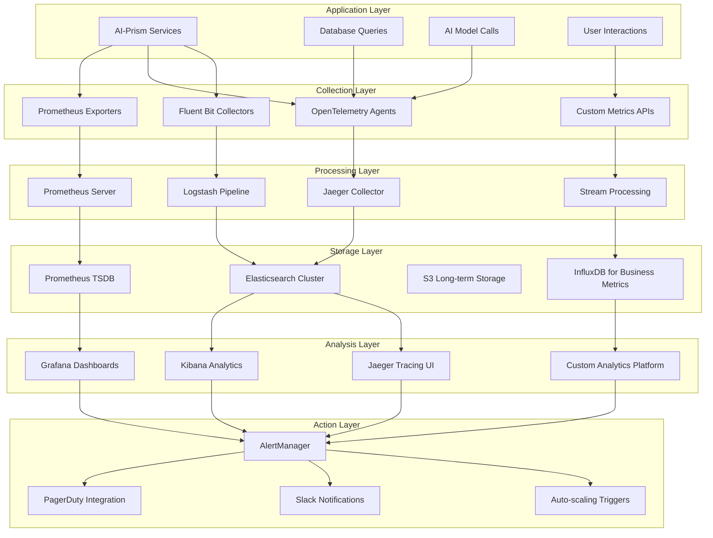

# 📊 TARA2 AI-Prism Monitoring & Observability Plan

## 📋 Executive Summary

This document outlines a comprehensive monitoring and observability strategy for TARA2 AI-Prism, establishing enterprise-grade visibility, alerting, and performance management capabilities. The plan transforms the current basic logging approach into a sophisticated observability platform supporting proactive operations, SRE practices, and data-driven decision making.

**Current Observability Maturity**: Level 1 (Basic Logging)
**Target Observability Maturity**: Level 5 (Full Observability with AI-Driven Insights)

---

## 🔍 Current Monitoring Analysis

### Existing Monitoring Capabilities

**Current Implementation Assessment**
```yaml
Logging:
  Current: Basic Python logging to stdout
  Limitations: 
    - No structured logging
    - Limited log aggregation
    - No log retention strategy
    - No log analysis capabilities
    
Metrics:
  Current: Basic activity counters in utils/activity_logger.py
  Limitations:
    - No real-time metrics collection
    - No performance metrics
    - No business metrics tracking
    - No alerting capabilities
    
Monitoring:
  Current: AWS CloudWatch integration via App Runner
  Limitations:
    - No custom dashboards
    - Limited alerting rules
    - No performance baselines
    - No capacity planning data
    
Health Checks:
  Current: Basic /health endpoint in Flask app
  Limitations:
    - Single health endpoint
    - No dependency health checks
    - No readiness vs liveness distinction
    - No detailed health status
```

**Current Observability Gaps**
```yaml
Critical Gaps:
  - No distributed tracing across services
  - No real-time performance monitoring
  - No business KPI tracking
  - No predictive analytics for capacity planning
  - No automated anomaly detection
  - No SLI/SLO monitoring
  - Limited incident management integration
  
Operational Impact:
  - Reactive instead of proactive operations
  - Difficult root cause analysis
  - No performance optimization insights
  - Limited capacity planning capabilities
  - No business impact measurement
```

---

## 🎯 Enterprise Observability Architecture

### 1. Three Pillars of Observability

**Comprehensive Observability Stack**
```yaml
Metrics (What is happening):
  Collection: Prometheus with exporters
  Storage: Long-term storage with Thanos
  Visualization: Grafana with custom dashboards
  Alerting: AlertManager with multi-channel notifications
  
Logs (Why it happened):
  Collection: Fluent Bit + OpenTelemetry Collector
  Processing: Logstash with custom parsers
  Storage: Elasticsearch with hot/warm/cold tiers
  Analysis: Kibana + custom log analytics
  
Traces (How it happened):
  Collection: OpenTelemetry instrumentation
  Processing: Jaeger/Zipkin for trace analysis
  Storage: Elasticsearch backend
  Analysis: Jaeger UI + custom trace analytics
```

**Observability Data Flow**


### 2. Application Performance Monitoring (APM)

**Comprehensive APM Implementation**
```python
import time
import asyncio
from typing import Dict, Any, Optional, List
from dataclasses import dataclass
import opentelemetry
from opentelemetry import trace, metrics, baggage
from opentelemetry.exporter.prometheus import PrometheusMetricReader
from opentelemetry.sdk.metrics import MeterProvider
from opentelemetry.sdk.trace import TracerProvider
from opentelemetry.instrumentation.fastapi import FastAPIInstrumentor
from prometheus_client import Counter, Histogram, Gauge, Summary

@dataclass
class PerformanceMetric:
    name: str
    value: float
    labels: Dict[str, str]
    timestamp: float

class EnterpriseAPMService:
    def __init__(self, service_name: str, version: str):
        self.service_name = service_name
        self.version = version
        
        # Initialize OpenTelemetry
        self.tracer_provider = TracerProvider()
        trace.set_tracer_provider(self.tracer_provider)
        self.tracer = trace.get_tracer(__name__)
        
        # Initialize metrics
        self.meter_provider = MeterProvider(
            metric_readers=[PrometheusMetricReader()],
        )
        metrics.set_meter_provider(self.meter_provider)
        self.meter = metrics.get_meter(__name__)
        
        # Business metrics
        self.document_processing_counter = Counter(
            'ai_prism_documents_processed_total',
            'Total documents processed',
            ['document_type', 'processing_status', 'user_type']
        )
        
        self.ai_analysis_duration = Histogram(
            'ai_prism_ai_analysis_duration_seconds',
            'AI analysis processing time',
            ['model_name', 'section_type', 'complexity'],
            buckets=(1, 5, 10, 30, 60, 120, 300, float('inf'))
        )
        
        self.user_satisfaction_score = Histogram(
            'ai_prism_user_satisfaction_score',
            'User satisfaction with AI analysis',
            ['feedback_type', 'user_segment'],
            buckets=(0.1, 0.3, 0.5, 0.7, 0.8, 0.9, 0.95, 1.0)
        )
        
        self.active_users_gauge = Gauge(
            'ai_prism_active_users',
            'Current number of active users',
            ['user_type', 'organization']
        )
        
        self.api_request_duration = Histogram(
            'ai_prism_http_request_duration_seconds',
            'HTTP request duration',
            ['method', 'endpoint', 'status_code'],
            buckets=(0.01, 0.025, 0.05, 0.1, 0.25, 0.5, 1.0, 2.5, 5.0, 10.0, float('inf'))
        )
        
        self.business_kpi_gauge = Gauge(
            'ai_prism_business_kpi',
            'Business KPI metrics',
            ['kpi_name', 'organization', 'time_period']
        )
    
    async def track_document_processing(self, document_info: Dict, 
                                      processing_result: Dict):
        """Track document processing metrics with rich context"""
        
        with self.tracer.start_as_current_span("document_processing") as span:
            # Add span attributes
            span.set_attribute("document.id", document_info['id'])
            span.set_attribute("document.type", document_info['type'])
            span.set_attribute("document.size_bytes", document_info['size'])
            span.set_attribute("user.id", document_info['user_id'])
            span.set_attribute("user.organization", document_info['organization'])
            
            # Record business metrics
            self.document_processing_counter.labels(
                document_type=document_info['type'],
                processing_status=processing_result['status'],
                user_type=document_info.get('user_tier', 'standard')
            ).inc()
            
            # Track processing duration by section
            for section_result in processing_result.get('sections', []):
                self.ai_analysis_duration.labels(
                    model_name=section_result['model_used'],
                    section_type=section_result['section_type'],
                    complexity=section_result['complexity_score']
                ).observe(section_result['processing_time'])
            
            # Track user satisfaction if available
            if 'user_feedback' in processing_result:
                satisfaction_score = processing_result['user_feedback']['satisfaction_score']
                self.user_satisfaction_score.labels(
                    feedback_type=processing_result['user_feedback']['type'],
                    user_segment=document_info.get('user_segment', 'general')
                ).observe(satisfaction_score)
    
    async def track_api_performance(self, request_info: Dict, 
                                   response_info: Dict,
                                   duration_seconds: float):
        """Track API performance metrics"""
        
        # Create trace for request
        with self.tracer.start_as_current_span("api_request") as span:
            # Add request context to span
            span.set_attribute("http.method", request_info['method'])
            span.set_attribute("http.url", request_info['url'])
            span.set_attribute("http.status_code", response_info['status_code'])
            span.set_attribute("user.id", request_info.get('user_id', 'anonymous'))
            
            # Add custom attributes
            if 'document_id' in request_info:
                span.set_attribute("document.id", request_info['document_id'])
            
            # Record performance metrics
            self.api_request_duration.labels(
                method=request_info['method'],
                endpoint=self._normalize_endpoint(request_info['path']),
                status_code=response_info['status_code']
            ).observe(duration_seconds)
    
    async def update_business_kpis(self, kpi_data: Dict):
        """Update business KPI metrics"""
        
        for kpi_name, kpi_info in kpi_data.items():
            self.business_kpi_gauge.labels(
                kpi_name=kpi_name,
                organization=kpi_info.get('organization', 'all'),
                time_period=kpi_info.get('time_period', 'current')
            ).set(kpi_info['value'])
    
    def _normalize_endpoint(self, path: str) -> str:
        """Normalize API endpoint for consistent metrics"""
        # Replace IDs with placeholders to avoid high cardinality
        import re
        normalized = re.sub(r'/[0-9a-f-]{36}', '/{id}', path)  # UUID
        normalized = re.sub(r'/\d+', '/{id}', normalized)  # Numeric IDs
        return normalized
```

### 3. Infrastructure Monitoring

**Kubernetes Monitoring Strategy**
```yaml
# kube-prometheus-stack configuration
apiVersion: v1
kind: ConfigMap
metadata:
  name: prometheus-config
  namespace: monitoring
data:
  prometheus.yml: |
    global:
      scrape_interval: 15s
      evaluation_interval: 15s
      external_labels:
        cluster: ai-prism-prod
        region: us-east-1
    
    rule_files:
      - "/etc/prometheus/rules/*.yml"
    
    scrape_configs:
    # Kubernetes API server
    - job_name: 'kubernetes-apiservers'
      kubernetes_sd_configs:
      - role: endpoints
        namespaces:
          names:
          - default
      scheme: https
      tls_config:
        ca_file: /var/run/secrets/kubernetes.io/serviceaccount/ca.crt
      bearer_token_file: /var/run/secrets/kubernetes.io/serviceaccount/token
      relabel_configs:
      - source_labels: [__meta_kubernetes_namespace, __meta_kubernetes_service_name, __meta_kubernetes_endpoint_port_name]
        action: keep
        regex: default;kubernetes;https
    
    # Node metrics
    - job_name: 'kubernetes-nodes'
      kubernetes_sd_configs:
      - role: node
      scheme: https
      tls_config:
        ca_file: /var/run/secrets/kubernetes.io/serviceaccount/ca.crt
      bearer_token_file: /var/run/secrets/kubernetes.io/serviceaccount/token
      relabel_configs:
      - action: labelmap
        regex: __meta_kubernetes_node_label_(.+)
    
    # Pod metrics
    - job_name: 'kubernetes-pods'
      kubernetes_sd_configs:
      - role: pod
      relabel_configs:
      - source_labels: [__meta_kubernetes_pod_annotation_prometheus_io_scrape]
        action: keep
        regex: true
      - source_labels: [__meta_kubernetes_pod_annotation_prometheus_io_path]
        action: replace
        target_label: __metrics_path__
        regex: (.+)
      - source_labels: [__address__, __meta_kubernetes_pod_annotation_prometheus_io_port]
        action: replace
        regex: ([^:]+)(?::\d+)?;(\d+)
        replacement: $1:$2
        target_label: __address__
    
    # AI-Prism specific services
    - job_name: 'ai-prism-services'
      static_configs:
      - targets: ['ai-prism-api:8080', 'ai-prism-worker:8080']
      metrics_path: '/metrics'
      scrape_interval: 30s
      
    # External dependencies monitoring
    - job_name: 'external-dependencies'
      static_configs:
      - targets: ['database-exporter:9100', 'redis-exporter:9121']
      scrape_interval: 30s

---
# AlertManager configuration
apiVersion: v1
kind: ConfigMap
metadata:
  name: alertmanager-config
  namespace: monitoring
data:
  alertmanager.yml: |
    global:
      smtp_smarthost: 'smtp.company.com:587'
      smtp_from: 'alerts@ai-prism.com'
    
    route:
      group_by: ['alertname', 'cluster', 'service']
      group_wait: 30s
      group_interval: 5m
      repeat_interval: 12h
      receiver: 'default-receiver'
      routes:
      # Critical alerts - immediate notification
      - match:
          severity: critical
        receiver: 'critical-alerts'
        group_wait: 10s
        repeat_interval: 5m
      
      # High priority alerts - 15 minute notification
      - match:
          severity: warning
        receiver: 'warning-alerts'
        group_wait: 2m
        repeat_interval: 1h
    
    receivers:
    - name: 'default-receiver'
      email_configs:
      - to: 'devops@company.com'
        subject: 'AI-Prism Alert: {{ .GroupLabels.alertname }}'
        body: |
          {{ range .Alerts }}
          Alert: {{ .Annotations.summary }}
          Description: {{ .Annotations.description }}
          Details: {{ .Labels }}
          {{ end }}
    
    - name: 'critical-alerts'
      email_configs:
      - to: 'oncall@company.com'
        subject: '🚨 CRITICAL: AI-Prism {{ .GroupLabels.alertname }}'
      pagerduty_configs:
      - service_key: 'YOUR_PAGERDUTY_SERVICE_KEY'
        description: 'Critical AI-Prism alert: {{ .GroupLabels.alertname }}'
      slack_configs:
      - api_url: 'YOUR_SLACK_WEBHOOK_URL'
        channel: '#critical-alerts'
        title: '🚨 Critical Alert: {{ .GroupLabels.alertname }}'
        text: '{{ range .Alerts }}{{ .Annotations.description }}{{ end }}'
    
    - name: 'warning-alerts'
      slack_configs:
      - api_url: 'YOUR_SLACK_WEBHOOK_URL'
        channel: '#alerts'
        title: '⚠️ Warning: {{ .GroupLabels.alertname }}'
```

### 2. Custom Metrics Implementation

**Business and Technical Metrics Collection**
```python
import asyncio
import aioredis
from prometheus_client import Counter, Histogram, Gauge, Summary, CollectorRegistry
from typing import Dict, List, Optional
import json
from datetime import datetime, timedelta

class ComprehensiveMetricsCollector:
    def __init__(self, service_name: str):
        self.service_name = service_name
        self.registry = CollectorRegistry()
        self.redis_client = aioredis.Redis(host='redis-cluster')
        
        # Technical Performance Metrics
        self.http_requests_total = Counter(
            'ai_prism_http_requests_total',
            'Total HTTP requests',
            ['method', 'endpoint', 'status_code', 'user_tier'],
            registry=self.registry
        )
        
        self.http_request_duration = Histogram(
            'ai_prism_http_request_duration_seconds',
            'HTTP request duration',
            ['method', 'endpoint', 'status_code'],
            buckets=(0.01, 0.025, 0.05, 0.1, 0.25, 0.5, 1.0, 2.5, 5.0, 10.0, float('inf')),
            registry=self.registry
        )
        
        # AI/ML Specific Metrics
        self.ai_model_requests = Counter(
            'ai_prism_ai_model_requests_total',
            'Total AI model requests',
            ['model_name', 'request_type', 'status'],
            registry=self.registry
        )
        
        self.ai_model_latency = Histogram(
            'ai_prism_ai_model_latency_seconds',
            'AI model response latency',
            ['model_name', 'complexity'],
            buckets=(1, 5, 10, 30, 60, 120, 300, 600, float('inf')),
            registry=self.registry
        )
        
        self.ai_model_cost = Counter(
            'ai_prism_ai_model_cost_usd',
            'AI model usage cost',
            ['model_name', 'organization'],
            registry=self.registry
        )
        
        # Business Metrics
        self.active_users = Gauge(
            'ai_prism_active_users',
            'Current active users',
            ['time_window', 'user_type', 'organization'],
            registry=self.registry
        )
        
        self.document_analysis_quality = Histogram(
            'ai_prism_analysis_quality_score',
            'Analysis quality score from user feedback',
            ['section_type', 'model_name'],
            buckets=(0.1, 0.3, 0.5, 0.7, 0.8, 0.9, 0.95, 1.0),
            registry=self.registry
        )
        
        self.user_engagement_score = Gauge(
            'ai_prism_user_engagement_score',
            'User engagement score',
            ['organization', 'time_period'],
            registry=self.registry
        )
        
        # System Health Metrics
        self.system_health_status = Gauge(
            'ai_prism_system_health',
            'System health status (1=healthy, 0=unhealthy)',
            ['component', 'check_type'],
            registry=self.registry
        )
        
        # Resource Utilization
        self.resource_utilization = Gauge(
            'ai_prism_resource_utilization_percent',
            'Resource utilization percentage',
            ['resource_type', 'service_name'],
            registry=self.registry
        )
        
    async def track_document_processing(self, document_id: str, user_context: Dict):
        """Comprehensive document processing tracking"""
        
        processing_start = time.time()
        
        with self.tracer.start_as_current_span("document_processing") as span:
            # Add rich context to trace
            span.set_attribute("document.id", document_id)
            span.set_attribute("document.size_bytes", user_context['document_size'])
            span.set_attribute("user.id", user_context['user_id'])
            span.set_attribute("user.organization", user_context['organization'])
            span.set_attribute("user.tier", user_context.get('tier', 'standard'))
            
            # Simulate document processing phases
            phases = [
                ('document_upload', 2),
                ('content_extraction', 5),
                ('section_detection', 3),
                ('ai_analysis', 15),
                ('result_compilation', 2)
            ]
            
            phase_results = {}
            
            for phase_name, estimated_duration in phases:
                with self.tracer.start_as_current_span(phase_name) as phase_span:
                    phase_start = time.time()
                    
                    # Simulate phase processing
                    await asyncio.sleep(estimated_duration * 0.1)  # Simulated work
                    
                    phase_duration = time.time() - phase_start
                    phase_results[phase_name] = {
                        'duration': phase_duration,
                        'status': 'completed'
                    }
                    
                    # Add phase metrics to span
                    phase_span.set_attribute(f"{phase_name}.duration_seconds", phase_duration)
                    phase_span.set_attribute(f"{phase_name}.status", 'completed')
            
            total_processing_time = time.time() - processing_start
            
            # Record metrics
            self.document_processing_counter.labels(
                document_type=user_context.get('document_type', 'unknown'),
                processing_status='completed',
                user_tier=user_context.get('tier', 'standard')
            ).inc()
            
            # Update active users
            await self.update_active_users_metrics()
            
            return {
                'total_processing_time': total_processing_time,
                'phase_results': phase_results,
                'trace_id': span.get_span_context().trace_id
            }
    
    async def collect_business_metrics(self) -> Dict:
        """Collect comprehensive business metrics"""
        
        business_metrics = {
            'collection_timestamp': datetime.now().isoformat(),
            'metrics': {}
        }
        
        # User engagement metrics
        engagement_data = await self.calculate_user_engagement_metrics()
        for org_id, engagement_score in engagement_data.items():
            self.user_engagement_score.labels(
                organization=org_id,
                time_period='daily'
            ).set(engagement_score)
            
            business_metrics['metrics'][f'engagement_{org_id}'] = engagement_score
        
        # Document processing volume
        processing_volume = await self.get_processing_volume_metrics()
        self.business_kpi_gauge.labels(
            kpi_name='documents_processed_24h',
            organization='all',
            time_period='daily'
        ).set(processing_volume['last_24h'])
        
        business_metrics['metrics']['processing_volume_24h'] = processing_volume['last_24h']
        
        # AI model performance metrics
        ai_performance = await self.calculate_ai_performance_metrics()
        for model_name, performance_data in ai_performance.items():
            self.business_kpi_gauge.labels(
                kpi_name=f'ai_accuracy_{model_name}',
                organization='all',
                time_period='weekly'
            ).set(performance_data['accuracy_score'])
        
        # Cost metrics
        cost_data = await self.calculate_cost_metrics()
        self.business_kpi_gauge.labels(
            kpi_name='cost_per_document',
            organization='all',
            time_period='daily'
        ).set(cost_data['cost_per_document'])
        
        business_metrics['metrics']['cost_per_document'] = cost_data['cost_per_document']
        
        return business_metrics
    
    async def update_active_users_metrics(self):
        """Update real-time active user metrics"""
        
        # Get active users from Redis (session store)
        active_sessions = await self.redis_client.keys('session:*')
        
        # Group by user type and organization
        user_counts = {'standard': {}, 'premium': {}, 'enterprise': {}}
        
        for session_key in active_sessions:
            session_data = await self.redis_client.hgetall(session_key)
            user_type = session_data.get('user_type', 'standard')
            organization = session_data.get('organization', 'unknown')
            
            if organization not in user_counts[user_type]:
                user_counts[user_type][organization] = 0
            user_counts[user_type][organization] += 1
        
        # Update gauges
        for user_type, org_counts in user_counts.items():
            for organization, count in org_counts.items():
                self.active_users_gauge.labels(
                    user_type=user_type,
                    organization=organization
                ).set(count)
```

---

## 📈 Alerting & Incident Management

### 1. Intelligent Alerting Framework

**Multi-Tier Alerting Strategy**
```yaml
Alert Severity Levels:

  Critical (P0) - Immediate Response:
    Triggers:
      - Service completely down (>5 minutes)
      - Error rate >10% for >2 minutes
      - Database connection failures
      - Security breach detection
      - Data corruption detected
    
    Notification Channels:
      - PagerDuty (immediate page)
      - Phone calls to on-call engineer
      - Slack #critical-alerts channel
      - SMS to engineering management
    
    Response SLA: 5 minutes acknowledgment, 15 minutes response
    
  High (P1) - Urgent Response:
    Triggers:
      - High latency >2s for >5 minutes
      - Error rate >5% for >5 minutes
      - AI model failures >20%
      - Disk space >90%
      - Memory usage >95%
    
    Notification Channels:
      - PagerDuty (high priority)
      - Slack #alerts channel
      - Email to on-call team
    
    Response SLA: 15 minutes acknowledgment, 1 hour response
    
  Warning (P2) - Standard Response:
    Triggers:
      - Performance degradation >1s
      - Error rate >1% for >15 minutes
      - Resource usage >80%
      - Failed health checks
    
    Notification Channels:
      - Slack #monitoring channel
      - Email to engineering team
    
    Response SLA: 1 hour acknowledgment, 4 hour response
    
  Info (P3) - Monitoring:
    Triggers:
      - Capacity planning thresholds
      - Performance trends
      - Configuration changes
      - Successful deployments
    
    Notification Channels:
      - Slack #monitoring channel
      - Daily digest emails
    
    Response SLA: Best effort, daily review
```

**Advanced Alerting Rules**
```yaml
# Prometheus alerting rules
groups:
- name: ai-prism-critical-alerts
  rules:
  # Service availability
  - alert: ServiceDown
    expr: up{job=~"ai-prism-.*"} == 0
    for: 2m
    labels:
      severity: critical
      service: "{{ $labels.job }}"
    annotations:
      summary: "AI-Prism service {{ $labels.job }} is down"
      description: "Service {{ $labels.job }} has been down for more than 2 minutes"
      runbook_url: "https://docs.ai-prism.com/runbooks/service-down"
      
  # High error rate
  - alert: HighErrorRate
    expr: rate(ai_prism_http_requests_total{status_code=~"5.."}[5m]) > 0.1
    for: 2m
    labels:
      severity: critical
      service: api
    annotations:
      summary: "High error rate detected"
      description: "Error rate is {{ $value | humanizePercentage }} for endpoint {{ $labels.endpoint }}"
      
  # Database connectivity
  - alert: DatabaseConnectionFailure
    expr: ai_prism_database_connections_failed_total > 0
    for: 1m
    labels:
      severity: critical
      component: database
    annotations:
      summary: "Database connection failures detected"
      description: "{{ $value }} database connection failures in the last minute"
      
- name: ai-prism-performance-alerts
  rules:
  # High latency
  - alert: HighLatency
    expr: histogram_quantile(0.95, rate(ai_prism_http_request_duration_seconds_bucket[5m])) > 2
    for: 5m
    labels:
      severity: warning
      component: performance
    annotations:
      summary: "High latency detected"
      description: "95th percentile latency is {{ $value }}s for {{ $labels.endpoint }}"
      
  # AI model performance degradation
  - alert: AIModelPerformanceDegraded
    expr: rate(ai_prism_ai_analysis_duration_seconds_sum[10m]) / rate(ai_prism_ai_analysis_duration_seconds_count[10m]) > 30
    for: 10m
    labels:
      severity: warning
      component: ai-processing
    annotations:
      summary: "AI model performance degraded"
      description: "Average AI processing time is {{ $value }}s, above 30s threshold"
      
- name: ai-prism-business-alerts
  rules:
  # User satisfaction drop
  - alert: UserSatisfactionDrop
    expr: avg_over_time(ai_prism_user_satisfaction_score[1h]) < 0.8
    for: 30m
    labels:
      severity: warning
      component: user-experience
    annotations:
      summary: "User satisfaction score dropped"
      description: "Average user satisfaction is {{ $value }}, below 0.8 threshold"
      
  # Document processing backlog
  - alert: DocumentProcessingBacklog
    expr: ai_prism_document_queue_size > 100
    for: 15m
    labels:
      severity: warning
      component: processing
    annotations:
      summary: "Document processing backlog detected"
      description: "{{ $value }} documents waiting for processing"
```

### 2. Automated Incident Management

**Intelligent Incident Response**
```python
import asyncio
from enum import Enum
from typing import Dict, List, Optional
from datetime import datetime, timedelta

class IncidentSeverity(Enum):
    P0_CRITICAL = "P0_critical"
    P1_HIGH = "P1_high"  
    P2_WARNING = "P2_warning"
    P3_INFO = "P3_info"

class AutomatedIncidentManager:
    def __init__(self):
        self.incident_store = IncidentStore()
        self.notification_service = NotificationService()
        self.remediation_engine = AutomatedRemediationEngine()
        self.metrics_analyzer = MetricsAnalyzer()
        
    async def handle_alert(self, alert_data: Dict) -> Dict:
        """Handle incoming alert with intelligent processing"""
        
        incident_response = {
            'alert_id': alert_data['alert_id'],
            'received_at': datetime.now().isoformat(),
            'severity': self.classify_severity(alert_data),
            'incident_created': False,
            'automated_actions_taken': [],
            'escalation_required': False
        }
        
        # 1. Intelligent alert correlation
        related_alerts = await self.find_related_alerts(alert_data)
        
        if related_alerts:
            # Check if this is part of an existing incident
            existing_incident = await self.find_existing_incident(related_alerts)
            if existing_incident:
                await self.update_incident_with_alert(existing_incident['id'], alert_data)
                incident_response['incident_id'] = existing_incident['id']
                incident_response['action'] = 'updated_existing_incident'
                return incident_response
        
        # 2. Create new incident if severity warrants it
        severity = IncidentSeverity(incident_response['severity'])
        if severity in [IncidentSeverity.P0_CRITICAL, IncidentSeverity.P1_HIGH]:
            
            incident = await self.create_incident(alert_data, related_alerts)
            incident_response['incident_id'] = incident['id']
            incident_response['incident_created'] = True
            
            # 3. Execute automated remediation
            if severity == IncidentSeverity.P0_CRITICAL:
                remediation_result = await self.execute_emergency_remediation(
                    incident, alert_data
                )
                incident_response['automated_actions_taken'] = remediation_result['actions']
            
            # 4. Intelligent notification
            await self.send_intelligent_notifications(incident, alert_data)
            
            # 5. Start automated investigation
            investigation_task = asyncio.create_task(
                self.start_automated_investigation(incident['id'])
            )
            incident_response['investigation_started'] = True
        
        else:
            # Low severity - just log and notify
            await self.log_alert(alert_data)
            await self.send_low_priority_notification(alert_data)
        
        return incident_response
    
    async def execute_emergency_remediation(self, incident: Dict, alert_data: Dict) -> Dict:
        """Execute automated emergency remediation"""
        
        remediation_actions = []
        alert_type = alert_data.get('alert_name', '')
        
        # Service down remediation
        if 'ServiceDown' in alert_type:
            # 1. Restart unhealthy pods
            restart_result = await self.remediation_engine.restart_unhealthy_pods(
                service=alert_data.get('service')
            )
            remediation_actions.append({
                'action': 'pod_restart',
                'result': restart_result,
                'executed_at': datetime.now().isoformat()
            })
            
            # 2. Scale up healthy instances
            if restart_result['success']:
                scale_result = await self.remediation_engine.emergency_scale_up(
                    service=alert_data.get('service'),
                    target_replicas=restart_result['recommended_replicas']
                )
                remediation_actions.append({
                    'action': 'emergency_scale_up',
                    'result': scale_result,
                    'executed_at': datetime.now().isoformat()
                })
        
        # High error rate remediation
        elif 'HighErrorRate' in alert_type:
            # 1. Enable circuit breaker
            circuit_breaker_result = await self.remediation_engine.enable_circuit_breaker(
                service=alert_data.get('service')
            )
            remediation_actions.append({
                'action': 'circuit_breaker_activation',
                'result': circuit_breaker_result,
                'executed_at': datetime.now().isoformat()
            })
            
            # 2. Route traffic to healthy instances
            traffic_routing_result = await self.remediation_engine.reroute_traffic(
                unhealthy_service=alert_data.get('service')
            )
            remediation_actions.append({
                'action': 'traffic_rerouting',
                'result': traffic_routing_result,
                'executed_at': datetime.now().isoformat()
            })
        
        # Database issues remediation
        elif 'Database' in alert_type:
            # 1. Check database health
            db_health = await self.remediation_engine.check_database_health()
            
            if not db_health['healthy']:
                # 2. Attempt connection pool reset
                pool_reset_result = await self.remediation_engine.reset_connection_pools()
                remediation_actions.append({
                    'action': 'connection_pool_reset',
                    'result': pool_reset_result,
                    'executed_at': datetime.now().isoformat()
                })
                
                # 3. Failover to read replica if needed
                if not pool_reset_result['success']:
                    failover_result = await self.remediation_engine.initiate_database_failover()
                    remediation_actions.append({
                        'action': 'database_failover',
                        'result': failover_result,
                        'executed_at': datetime.now().isoformat()
                    })
        
        return {
            'remediation_executed': True,
            'actions_count': len(remediation_actions),
            'actions': remediation_actions,
            'success_rate': sum(1 for action in remediation_actions if action['result']['success']) / len(remediation_actions) if remediation_actions else 0
        }
    
    async def start_automated_investigation(self, incident_id: str):
        """Start automated root cause analysis"""
        
        investigation_results = {
            'incident_id': incident_id,
            'investigation_start': datetime.now().isoformat(),
            'analysis_phases': [],
            'root_cause_candidates': [],
            'evidence_collected': []
        }
        
        # Phase 1: Metrics correlation analysis
        metrics_analysis = await self.analyze_metrics_correlation(incident_id)
        investigation_results['analysis_phases'].append({
            'phase': 'metrics_correlation',
            'findings': metrics_analysis,
            'completed_at': datetime.now().isoformat()
        })
        
        # Phase 2: Log analysis
        log_analysis = await self.analyze_relevant_logs(incident_id)
        investigation_results['analysis_phases'].append({
            'phase': 'log_analysis',
            'findings': log_analysis,
            'completed_at': datetime.now().isoformat()
        })
        
        # Phase 3: Trace analysis
        trace_analysis = await self.analyze_distributed_traces(incident_id)
        investigation_results['analysis_phases'].append({
            'phase': 'trace_analysis', 
            'findings': trace_analysis,
            'completed_at': datetime.now().isoformat()
        })
        
        # Phase 4: Root cause hypothesis generation
        root_cause_analysis = await self.generate_root_cause_hypotheses(
            metrics_analysis, log_analysis, trace_analysis
        )
        investigation_results['root_cause_candidates'] = root_cause_analysis
        
        # Store investigation results
        await self.store_investigation_results(investigation_results)
        
        return investigation_results
```

---

## 📊 Advanced Monitoring Dashboards

### 1. Executive Dashboard

**Business Intelligence Dashboard**
```python
class ExecutiveDashboard:
    def __init__(self):
        self.metrics_client = PrometheusClient()
        self.business_metrics = BusinessMetricsCalculator()
        
    async def generate_executive_dashboard_data(self, time_range: str = '24h') -> Dict:
        """Generate executive-level dashboard data"""
        
        dashboard_data = {
            'generated_at': datetime.now().isoformat(),
            'time_range': time_range,
            'kpis': {},
            'trends': {},
            'alerts_summary': {},
            'business_impact': {}
        }
        
        # Core Business KPIs
        kpis = await self.calculate_business_kpis(time_range)
        dashboard_data['kpis'] = {
            'active_users_current': kpis['active_users'],
            'documents_processed_24h': kpis['documents_processed'],
            'revenue_impact_24h': kpis['revenue_impact'],
            'customer_satisfaction': kpis['customer_satisfaction'],
            'system_availability': kpis['availability_percentage'],
            'cost_per_transaction': kpis['cost_per_transaction']
        }
        
        # Performance Trends
        trends = await self.calculate_performance_trends(time_range)
        dashboard_data['trends'] = {
            'user_growth': trends['user_growth_percentage'],
            'performance_trend': trends['response_time_trend'],
            'cost_trend': trends['cost_optimization_trend'],
            'quality_trend': trends['ai_quality_trend']
        }
        
        # Alerts and Incidents Summary
        alerts_summary = await self.get_alerts_summary(time_range)
        dashboard_data['alerts_summary'] = {
            'critical_incidents': alerts_summary['critical_count'],
            'total_alerts': alerts_summary['total_count'],
            'mttr_average': alerts_summary['mean_time_to_resolution'],
            'incident_trend': alerts_summary['trend']
        }
        
        # Business Impact Assessment
        business_impact = await self.assess_business_impact(time_range)
        dashboard_data['business_impact'] = {
            'revenue_at_risk': business_impact['revenue_at_risk'],
            'customer_impact': business_impact['affected_customers'],
            'sla_compliance': business_impact['sla_compliance_percentage'],
            'competitive_advantage': business_impact['competitive_metrics']
        }
        
        return dashboard_data
    
    async def calculate_business_kpis(self, time_range: str) -> Dict:
        """Calculate key business performance indicators"""
        
        # Query Prometheus for technical metrics
        queries = {
            'active_users': f'ai_prism_active_users{{time_window="current"}}',
            'documents_processed': f'increase(ai_prism_documents_processed_total[{time_range}])',
            'availability': f'avg_over_time(up{{job=~"ai-prism-.*"}}[{time_range}]) * 100',
            'error_rate': f'rate(ai_prism_http_requests_total{{status_code=~"5.."}}[{time_range}])',
            'response_time_p95': f'histogram_quantile(0.95, rate(ai_prism_http_request_duration_seconds_bucket[{time_range}]))'
        }
        
        metrics_results = {}
        for kpi_name, query in queries.items():
            try:
                result = await self.metrics_client.query(query)
                if result and result['data']['result']:
                    metrics_results[kpi_name] = float(result['data']['result'][0]['value'][1])
                else:
                    metrics_results[kpi_name] = 0.0
            except Exception as e:
                print(f"Failed to get metric {kpi_name}: {e}")
                metrics_results[kpi_name] = 0.0
        
        # Calculate derived business metrics
        revenue_per_document = 2.50  # Example: $2.50 revenue per document
        cost_per_document = 0.15     # Example: $0.15 cost per document
        
        business_kpis = {
            'active_users': int(metrics_results['active_users']),
            'documents_processed': int(metrics_results['documents_processed']),
            'availability_percentage': round(metrics_results['availability'], 2),
            'revenue_impact': round(metrics_results['documents_processed'] * revenue_per_document, 2),
            'cost_per_transaction': round(cost_per_document, 3),
            'customer_satisfaction': await self.calculate_customer_satisfaction(),
            'profit_margin': round(((revenue_per_document - cost_per_document) / revenue_per_document) * 100, 1)
        }
        
        return business_kpis
```

### 2. Technical Operations Dashboard

**Real-Time Operations Monitoring**
```yaml
# Grafana Dashboard Configuration
dashboard:
  title: "AI-Prism Technical Operations"
  tags: ["ai-prism", "production", "operations"]
  timezone: "UTC"
  refresh: "30s"
  time:
    from: "now-1h"
    to: "now"
  
  panels:
    # Row 1: Service Health Overview
    - title: "Service Health Status"
      type: "stat"
      targets:
        - expr: "up{job=~'ai-prism-.*'}"
          legendFormat: "{{ job }}"
      fieldConfig:
        defaults:
          mappings:
            - options:
                0: {"text": "DOWN", "color": "red"}
                1: {"text": "UP", "color": "green"}
          thresholds:
            steps:
              - color: "red"
                value: 0
              - color: "green" 
                value: 1
    
    # Row 1: Request Rate
    - title: "Request Rate (RPS)"
      type: "timeseries"
      targets:
        - expr: "rate(ai_prism_http_requests_total[5m])"
          legendFormat: "{{ method }} {{ endpoint }}"
      fieldConfig:
        defaults:
          unit: "reqps"
          min: 0
    
    # Row 1: Response Time
    - title: "Response Time Percentiles"
      type: "timeseries"
      targets:
        - expr: "histogram_quantile(0.50, rate(ai_prism_http_request_duration_seconds_bucket[5m]))"
          legendFormat: "P50"
        - expr: "histogram_quantile(0.95, rate(ai_prism_http_request_duration_seconds_bucket[5m]))"
          legendFormat: "P95"
        - expr: "histogram_quantile(0.99, rate(ai_prism_http_request_duration_seconds_bucket[5m]))"
          legendFormat: "P99"
      fieldConfig:
        defaults:
          unit: "s"
          min: 0
    
    # Row 2: Error Rates
    - title: "Error Rate by Service"
      type: "timeseries"
      targets:
        - expr: "rate(ai_prism_http_requests_total{status_code=~'4..'}[5m])"
          legendFormat: "4xx - {{ job }}"
        - expr: "rate(ai_prism_http_requests_total{status_code=~'5..'}[5m])"
          legendFormat: "5xx - {{ job }}"
      fieldConfig:
        defaults:
          unit: "percentunit"
          min: 0
    
    # Row 2: AI Processing Metrics
    - title: "AI Model Performance"
      type: "timeseries" 
      targets:
        - expr: "rate(ai_prism_ai_model_requests_total[5m])"
          legendFormat: "{{ model_name }} requests/sec"
        - expr: "histogram_quantile(0.95, rate(ai_prism_ai_model_latency_seconds_bucket[5m]))"
          legendFormat: "{{ model_name }} P95 latency"
      fieldConfig:
        defaults:
          unit: "s"
    
    # Row 3: Resource Utilization
    - title: "CPU Utilization by Pod"
      type: "heatmap"
      targets:
        - expr: "rate(container_cpu_usage_seconds_total{namespace='ai-prism-prod'}[5m]) * 100"
          legendFormat: "{{ pod }}"
      fieldConfig:
        defaults:
          unit: "percent"
          max: 100
    
    # Row 3: Memory Utilization
    - title: "Memory Utilization by Pod"
      type: "timeseries"
      targets:
        - expr: "container_memory_usage_bytes{namespace='ai-prism-prod'} / container_spec_memory_limit_bytes{namespace='ai-prism-prod'} * 100"
          legendFormat: "{{ pod }}"
      fieldConfig:
        defaults:
          unit: "percent"
          max: 100
          thresholds:
            steps:
              - color: "green"
                value: 0
              - color: "yellow"
                value: 70
              - color: "red"
                value: 90
    
    # Row 4: Business Metrics
    - title: "Documents Processed (24h)"
      type: "stat"
      targets:
        - expr: "increase(ai_prism_documents_processed_total[24h])"
      fieldConfig:
        defaults:
          unit: "short"
          thresholds:
            steps:
              - color: "red"
                value: 0
              - color: "yellow"
                value: 1000
              - color: "green"
                value: 5000
    
    # Row 4: Active Users
    - title: "Active Users by Type"
      type: "piechart"
      targets:
        - expr: "ai_prism_active_users"
          legendFormat: "{{ user_type }}"
    
    # Row 5: AI Cost Tracking
    - title: "AI Processing Costs (Daily)"
      type: "timeseries"
      targets:
        - expr: "increase(ai_prism_ai_model_cost_usd[24h])"
          legendFormat: "{{ model_name }}"
      fieldConfig:
        defaults:
          unit: "currencyUSD"
    
  # Alert annotations
  annotations:
    list:
      - name: "Deployments"
        datasource: "Prometheus"
        expr: "increase(ai_prism_deployment_timestamp[1m])"
        titleFormat: "Deployment"
        textFormat: "Version {{ version }} deployed"
      
      - name: "Incidents"  
        datasource: "Prometheus"
        expr: "ai_prism_incident_started"
        titleFormat: "Incident Started"
        textFormat: "{{ severity }} incident: {{ title }}"
```

---

## 🔍 Log Management & Analysis

### 1. Structured Logging Implementation

**Enterprise Logging Framework**
```python
import json
import logging
import sys
from typing import Dict, Any, Optional
from datetime import datetime
from contextvars import ContextVar
from dataclasses import dataclass, asdict

# Context variables for request tracing
request_id_var: ContextVar[str] = ContextVar('request_id', default='')
user_id_var: ContextVar[str] = ContextVar('user_id', default='')
organization_id_var: ContextVar[str] = ContextVar('organization_id', default='')

@dataclass
class LogEvent:
    timestamp: str
    level: str
    logger: str
    message: str
    service: str
    version: str
    environment: str
    request_id: Optional[str] = None
    user_id: Optional[str] = None
    organization_id: Optional[str] = None
    trace_id: Optional[str] = None
    span_id: Optional[str] = None
    duration_ms: Optional[float] = None
    error_type: Optional[str] = None
    stack_trace: Optional[str] = None
    custom_fields: Optional[Dict[str, Any]] = None

class StructuredLogger:
    def __init__(self, service_name: str, version: str, environment: str):
        self.service_name = service_name
        self.version = version
        self.environment = environment
        
        # Configure Python logging
        self.logger = logging.getLogger(service_name)
        self.logger.setLevel(logging.INFO)
        
        # Create JSON formatter
        handler = logging.StreamHandler(sys.stdout)
        handler.setFormatter(self.JSONFormatter())
        self.logger.addHandler(handler)
    
    class JSONFormatter(logging.Formatter):
        def format(self, record):
            # Get current context
            request_id = request_id_var.get('')
            user_id = user_id_var.get('')
            organization_id = organization_id_var.get('')
            
            # Create structured log event
            log_event = LogEvent(
                timestamp=datetime.utcnow().isoformat() + 'Z',
                level=record.levelname,
                logger=record.name,
                message=record.getMessage(),
                service=getattr(record, 'service', 'ai-prism'),
                version=getattr(record, 'version', 'unknown'),
                environment=getattr(record, 'environment', 'development'),
                request_id=request_id or getattr(record, 'request_id', None),
                user_id=user_id or getattr(record, 'user_id', None),
                organization_id=organization_id or getattr(record, 'organization_id', None),
                trace_id=getattr(record, 'trace_id', None),
                span_id=getattr(record, 'span_id', None),
                duration_ms=getattr(record, 'duration_ms', None),
                error_type=getattr(record, 'error_type', None),
                stack_trace=record.exc_text if record.exc_info else None,
                custom_fields=getattr(record, 'custom_fields', None)
            )
            
            # Convert to JSON
            return json.dumps(asdict(log_event), default=str)
    
    def info(self, message: str, **kwargs):
        """Log info message with context"""
        extra = self._prepare_extra(**kwargs)
        self.logger.info(message, extra=extra)
    
    def warning(self, message: str, **kwargs):
        """Log warning message with context"""
        extra = self._prepare_extra(**kwargs)
        self.logger.warning(message, extra=extra)
    
    def error(self, message: str, error: Optional[Exception] = None, **kwargs):
        """Log error message with context"""
        extra = self._prepare_extra(**kwargs)
        if error:
            extra['error_type'] = type(error).__name__
        
        self.logger.error(message, exc_info=error, extra=extra)
    
    def _prepare_extra(self, **kwargs) -> Dict[str, Any]:
        """Prepare extra fields for logging"""
        extra = {
            'service': self.service_name,
            'version': self.version,
            'environment': self.environment
        }
        extra.update(kwargs)
        return extra

# Usage example in application
class DocumentProcessingService:
    def __init__(self):
        self.logger = StructuredLogger(
            service_name="document-processor",
            version="2.1.0",
            environment="production"
        )
        
    async def process_document(self, document_id: str, user_id: str):
        # Set request context
        request_id_var.set(f"req_{int(time.time())}")
        user_id_var.set(user_id)
        
        self.logger.info(
            "Starting document processing",
            document_id=document_id,
            user_id=user_id,
            custom_fields={'processing_type': 'ai_analysis'}
        )
        
        try:
            processing_start = time.time()
            
            # Simulate processing
            await asyncio.sleep(2)
            
            processing_duration = (time.time() - processing_start) * 1000
            
            self.logger.info(
                "Document processing completed successfully",
                document_id=document_id,
                duration_ms=processing_duration,
                custom_fields={'sections_processed': 5, 'feedback_items': 12}
            )
            
        except Exception as e:
            self.logger.error(
                "Document processing failed",
                error=e,
                document_id=document_id,
                custom_fields={'failure_reason': 'ai_model_timeout'}
            )
            raise
```

### 2. Log Analysis & Intelligence

**AI-Powered Log Analysis**
```python
import re
import pandas as pd
from typing import Dict, List, Tuple
from sklearn.feature_extraction.text import TfidfVectorizer
from sklearn.cluster import KMeans
import numpy as np

class IntelligentLogAnalyzer:
    def __init__(self):
        self.log_patterns = self.load_known_patterns()
        self.anomaly_detector = LogAnomalyDetector()
        self.pattern_classifier = LogPatternClassifier()
        
    async def analyze_log_stream(self, logs: List[Dict], 
                               analysis_window_minutes: int = 60) -> Dict:
        """Analyze log stream for anomalies and patterns"""
        
        analysis_results = {
            'analysis_id': f"log_analysis_{int(datetime.now().timestamp())}",
            'analyzed_at': datetime.now().isoformat(),
            'window_minutes': analysis_window_minutes,
            'total_logs': len(logs),
            'findings': {
                'anomalies': [],
                'error_patterns': [],
                'performance_issues': [],
                'security_events': []
            },
            'metrics': {},
            'recommendations': []
        }
        
        if not logs:
            return analysis_results
        
        # 1. Extract log metrics
        metrics = self.extract_log_metrics(logs)
        analysis_results['metrics'] = metrics
        
        # 2. Detect anomalies
        anomalies = await self.detect_log_anomalies(logs)
        analysis_results['findings']['anomalies'] = anomalies
        
        # 3. Identify error patterns
        error_patterns = await self.identify_error_patterns(logs)
        analysis_results['findings']['error_patterns'] = error_patterns
        
        # 4. Performance issue detection
        performance_issues = await self.detect_performance_issues(logs)
        analysis_results['findings']['performance_issues'] = performance_issues
        
        # 5. Security event analysis
        security_events = await self.analyze_security_events(logs)
        analysis_results['findings']['security_events'] = security_events
        
        # 6. Generate recommendations
        analysis_results['recommendations'] = await self.generate_recommendations(
            analysis_results['findings']
        )
        
        return analysis_results
    
    async def detect_log_anomalies(self, logs: List[Dict]) -> List[Dict]:
        """Detect anomalies in log patterns using ML"""
        
        anomalies = []
        
        # 1. Extract log message features
        log_messages = [log.get('message', '') for log in logs]
        
        if len(log_messages) < 50:  # Not enough data for ML analysis
            return []
        
        # 2. Vectorize log messages
        vectorizer = TfidfVectorizer(
            max_features=1000,
            stop_words='english',
            min_df=2,
            max_df=0.95
        )
        
        try:
            log_vectors = vectorizer.fit_transform(log_messages)
        except ValueError:
            # Not enough meaningful content
            return []
        
        # 3. Cluster log messages to find normal patterns
        n_clusters = min(20, max(3, len(log_messages) // 10))
        kmeans = KMeans(n_clusters=n_clusters, random_state=42)
        clusters = kmeans.fit_predict(log_vectors.toarray())
        
        # 4. Identify outlier logs (small clusters or distant from centroids)
        cluster_sizes = np.bincount(clusters)
        
        for i, (log, cluster_id) in enumerate(zip(logs, clusters)):
            cluster_size = cluster_sizes[cluster_id]
            
            # Consider logs in small clusters as anomalies
            if cluster_size < len(logs) * 0.05:  # Less than 5% of total logs
                
                # Calculate distance from cluster centroid
                log_vector = log_vectors[i].toarray().flatten()
                centroid = kmeans.cluster_centers_[cluster_id]
                distance = np.linalg.norm(log_vector - centroid)
                
                anomalies.append({
                    'log_index': i,
                    'timestamp': log.get('timestamp'),
                    'message': log.get('message', '')[:200],
                    'anomaly_type': 'rare_pattern',
                    'cluster_id': int(cluster_id),
                    'cluster_size': int(cluster_size),
                    'distance_score': float(distance),
                    'severity': 'high' if distance > 2.0 else 'medium',
                    'log_level': log.get('level'),
                    'service': log.get('service')
                })
        
        return anomalies
    
    async def identify_error_patterns(self, logs: List[Dict]) -> List[Dict]:
        """Identify common error patterns and their root causes"""
        
        error_logs = [log for log in logs if log.get('level') in ['ERROR', 'CRITICAL']]
        
        if not error_logs:
            return []
        
        # Group errors by similar patterns
        error_patterns = {}
        
        for error_log in error_logs:
            message = error_log.get('message', '')
            
            # Normalize error message for pattern matching
            normalized_message = self.normalize_error_message(message)
            pattern_key = self.extract_error_pattern(normalized_message)
            
            if pattern_key not in error_patterns:
                error_patterns[pattern_key] = {
                    'pattern': pattern_key,
                    'occurrences': [],
                    'affected_services': set(),
                    'first_seen': error_log.get('timestamp'),
                    'last_seen': error_log.get('timestamp')
                }
            
            pattern_info = error_patterns[pattern_key]
            pattern_info['occurrences'].append(error_log)
            pattern_info['affected_services'].add(error_log.get('service', 'unknown'))
            pattern_info['last_seen'] = error_log.get('timestamp')
        
        # Convert to list and add analysis
        pattern_analysis = []
        for pattern_key, pattern_info in error_patterns.items():
            occurrence_count = len(pattern_info['occurrences'])
            
            if occurrence_count >= 3:  # Pattern with multiple occurrences
                pattern_analysis.append({
                    'pattern': pattern_key,
                    'occurrence_count': occurrence_count,
                    'affected_services': list(pattern_info['affected_services
']),
                    'time_span_minutes': self.calculate_time_span_minutes(
                        pattern_info['first_seen'],
                        pattern_info['last_seen']
                    ),
                    'frequency_per_hour': self.calculate_frequency_per_hour(
                        occurrence_count,
                        pattern_info['first_seen'],
                        pattern_info['last_seen']
                    ),
                    'severity': 'high' if occurrence_count > 10 else 'medium',
                    'root_cause_hints': self.extract_root_cause_hints(pattern_info['occurrences']),
                    'example_logs': pattern_info['occurrences'][:3]  # First 3 examples
                })
        
        return pattern_analysis
    
    def normalize_error_message(self, message: str) -> str:
        """Normalize error message for pattern matching"""
        # Remove specific IDs, timestamps, and variable content
        normalized = re.sub(r'\b[0-9a-f-]{36}\b', '{UUID}', message)  # UUIDs
        normalized = re.sub(r'\b\d{4}-\d{2}-\d{2}T\d{2}:\d{2}:\d{2}\b', '{TIMESTAMP}', normalized)  # ISO timestamps
        normalized = re.sub(r'\b\d+\b', '{NUMBER}', normalized)  # Numbers
        normalized = re.sub(r'\b[a-zA-Z0-9._%+-]+@[a-zA-Z0-9.-]+\.[a-zA-Z]{2,}\b', '{EMAIL}', normalized)  # Emails
        return normalized.strip()
```

### 3. Distributed Tracing Implementation

**OpenTelemetry Tracing Strategy**
```python
from opentelemetry import trace, context, baggage
from opentelemetry.exporter.jaeger.thrift import JaegerExporter
from opentelemetry.sdk.trace import TracerProvider
from opentelemetry.sdk.trace.export import BatchSpanProcessor
from opentelemetry.instrumentation.fastapi import FastAPIInstrumentor
from opentelemetry.instrumentation.asyncpg import AsyncPGInstrumentor
from opentelemetry.instrumentation.redis import RedisInstrumentor
import time
import asyncio

class EnterpriseTracingService:
    def __init__(self, service_name: str, jaeger_endpoint: str):
        self.service_name = service_name
        
        # Initialize tracer provider
        trace.set_tracer_provider(TracerProvider())
        tracer_provider = trace.get_tracer_provider()
        
        # Configure Jaeger exporter
        jaeger_exporter = JaegerExporter(
            agent_host_name="jaeger-agent",
            agent_port=14268,
            collector_endpoint=jaeger_endpoint,
        )
        
        # Add span processor
        span_processor = BatchSpanProcessor(
            jaeger_exporter,
            max_queue_size=2048,
            schedule_delay_millis=5000,
            max_export_batch_size=512,
        )
        tracer_provider.add_span_processor(span_processor)
        
        # Get tracer
        self.tracer = trace.get_tracer(service_name)
        
        # Auto-instrument common libraries
        FastAPIInstrumentor.instrument()
        AsyncPGInstrumentor.instrument()
        RedisInstrumentor.instrument()
    
    async def trace_document_analysis_pipeline(self, document_id: str, 
                                             user_context: Dict) -> Dict:
        """Trace complete document analysis pipeline"""
        
        with self.tracer.start_as_current_span("document_analysis_pipeline") as root_span:
            # Add root span attributes
            root_span.set_attribute("document.id", document_id)
            root_span.set_attribute("user.id", user_context['user_id'])
            root_span.set_attribute("user.organization", user_context['organization'])
            root_span.set_attribute("pipeline.version", "2.1.0")
            
            # Set baggage for cross-service context
            ctx = baggage.set_baggage("document.id", document_id)
            ctx = baggage.set_baggage("user.organization", user_context['organization'], context=ctx)
            
            pipeline_results = {}
            
            # Phase 1: Document preprocessing
            with self.tracer.start_as_current_span("document_preprocessing") as preprocess_span:
                preprocess_start = time.time()
                
                # Simulate preprocessing
                preprocessing_result = await self.preprocess_document(document_id)
                
                preprocessing_duration = time.time() - preprocess_start
                preprocess_span.set_attribute("preprocessing.duration_seconds", preprocessing_duration)
                preprocess_span.set_attribute("sections.detected", len(preprocessing_result['sections']))
                preprocess_span.set_attribute("document.complexity_score", preprocessing_result['complexity'])
                
                pipeline_results['preprocessing'] = preprocessing_result
            
            # Phase 2: AI analysis (parallel processing)
            with self.tracer.start_as_current_span("ai_analysis_parallel") as ai_span:
                ai_start = time.time()
                
                # Process sections in parallel with individual tracing
                section_tasks = []
                for section_info in pipeline_results['preprocessing']['sections']:
                    task = self.trace_section_analysis(section_info)
                    section_tasks.append(task)
                
                section_results = await asyncio.gather(*section_tasks)
                
                ai_duration = time.time() - ai_start
                ai_span.set_attribute("ai_analysis.total_duration_seconds", ai_duration)
                ai_span.set_attribute("ai_analysis.sections_processed", len(section_results))
                ai_span.set_attribute("ai_analysis.parallel_execution", True)
                
                pipeline_results['ai_analysis'] = {
                    'sections': section_results,
                    'total_duration': ai_duration
                }
            
            # Phase 3: Results compilation
            with self.tracer.start_as_current_span("results_compilation") as compile_span:
                compile_start = time.time()
                
                compilation_result = await self.compile_analysis_results(section_results)
                
                compile_duration = time.time() - compile_start
                compile_span.set_attribute("compilation.duration_seconds", compile_duration)
                compile_span.set_attribute("feedback_items.total", compilation_result['total_feedback_items'])
                compile_span.set_attribute("risk_assessment.high", compilation_result['high_risk_count'])
                
                pipeline_results['compilation'] = compilation_result
            
            # Phase 4: Quality assurance
            with self.tracer.start_as_current_span("quality_assurance") as qa_span:
                qa_result = await self.quality_assurance_check(pipeline_results)
                qa_span.set_attribute("quality_score", qa_result['quality_score'])
                qa_span.set_attribute("quality_passed", qa_result['passed'])
                
                pipeline_results['quality_assurance'] = qa_result
            
            # Add pipeline summary to root span
            total_pipeline_duration = time.time() - root_span.start_time / 1_000_000_000  # Convert from nanoseconds
            root_span.set_attribute("pipeline.total_duration_seconds", total_pipeline_duration)
            root_span.set_attribute("pipeline.status", "completed")
            root_span.set_attribute("pipeline.quality_score", pipeline_results['quality_assurance']['quality_score'])
            
            return pipeline_results
    
    async def trace_section_analysis(self, section_info: Dict) -> Dict:
        """Trace individual section analysis with detailed spans"""
        
        with self.tracer.start_as_current_span("section_analysis") as section_span:
            section_span.set_attribute("section.name", section_info['name'])
            section_span.set_attribute("section.type", section_info['type'])
            section_span.set_attribute("section.word_count", section_info['word_count'])
            section_span.set_attribute("section.complexity", section_info['complexity'])
            
            # Model selection
            with self.tracer.start_as_current_span("model_selection") as model_span:
                selected_model = await self.select_optimal_model(section_info)
                model_span.set_attribute("selected_model", selected_model['name'])
                model_span.set_attribute("selection_reason", selected_model['reason'])
            
            # AI model invocation
            with self.tracer.start_as_current_span("ai_model_invocation") as ai_span:
                ai_start = time.time()
                
                ai_response = await self.invoke_ai_model(
                    selected_model['name'],
                    section_info['content']
                )
                
                ai_duration = time.time() - ai_start
                ai_span.set_attribute("ai_model.name", selected_model['name'])
                ai_span.set_attribute("ai_model.response_time_seconds", ai_duration)
                ai_span.set_attribute("ai_model.tokens_used", ai_response.get('tokens_used', 0))
                ai_span.set_attribute("ai_model.cost_usd", ai_response.get('cost', 0))
                ai_span.set_attribute("feedback_items.generated", len(ai_response.get('feedback_items', [])))
            
            # Post-processing
            with self.tracer.start_as_current_span("post_processing") as post_span:
                processed_result = await self.post_process_ai_response(
                    ai_response,
                    section_info
                )
                
                post_span.set_attribute("post_processing.validation_passed", processed_result['valid'])
                post_span.set_attribute("post_processing.feedback_items", len(processed_result['feedback_items']))
            
            return processed_result
```

---

## 📊 Service Level Monitoring

### 1. SLI/SLO Implementation

**Service Level Objectives Definition**
```yaml
AI-Prism Service Level Objectives:

  Availability SLO:
    Measurement: Successful requests / Total requests
    Target: 99.9% (43.8 minutes downtime per month)
    Measurement Window: 30 days rolling
    Error Budget: 0.1% (72 minutes per month)
    
  Latency SLO:
    API Response Time:
      Measurement: P95 response time for API calls
      Target: <500ms for 95% of requests
      Measurement Window: 24 hours rolling
      
    Document Processing:
      Measurement: End-to-end processing time
      Target: <30 seconds for 90% of documents
      Measurement Window: 7 days rolling
      
  Quality SLO:
    AI Analysis Accuracy:
      Measurement: User satisfaction score for AI feedback
      Target: >85% user approval rating
      Measurement Window: 7 days rolling
      
    Document Processing Success:
      Measurement: Successful processing / Total attempts  
      Target: >98% successful processing rate
      Measurement Window: 24 hours rolling

Alerting Based on SLO Burn Rate:
  
  Fast Burn (Error Budget consumed in <2 hours):
    Action: Page on-call engineer immediately
    Threshold: Burn rate >36x normal rate
    
  Medium Burn (Error Budget consumed in <6 hours):
    Action: Create high-priority alert
    Threshold: Burn rate >6x normal rate
    
  Slow Burn (Error Budget consumed in <3 days):
    Action: Create monitoring alert
    Threshold: Burn rate >1x normal rate
```

**SLO Monitoring Implementation**
```python
import asyncio
from typing import Dict, List, Optional
import numpy as np
from datetime import datetime, timedelta

class SLOMonitoringService:
    def __init__(self, prometheus_client):
        self.prometheus = prometheus_client
        self.slo_configs = self.load_slo_configurations()
        self.error_budget_calculator = ErrorBudgetCalculator()
        
    def load_slo_configurations(self) -> Dict:
        """Load SLO configurations for all services"""
        return {
            'availability': {
                'name': 'Service Availability',
                'target': 0.999,  # 99.9%
                'measurement_window_days': 30,
                'query': 'rate(ai_prism_http_requests_total{status_code!~"5.."}[30d]) / rate(ai_prism_http_requests_total[30d])'
            },
            'latency_api': {
                'name': 'API Response Time',
                'target': 0.5,  # 500ms
                'percentile': 95,
                'measurement_window_hours': 24,
                'query': 'histogram_quantile(0.95, rate(ai_prism_http_request_duration_seconds_bucket[24h]))'
            },
            'latency_processing': {
                'name': 'Document Processing Time', 
                'target': 30.0,  # 30 seconds
                'percentile': 90,
                'measurement_window_hours': 168,  # 7 days
                'query': 'histogram_quantile(0.90, rate(ai_prism_ai_analysis_duration_seconds_bucket[7d]))'
            },
            'quality_satisfaction': {
                'name': 'User Satisfaction',
                'target': 0.85,  # 85%
                'measurement_window_hours': 168,
                'query': 'avg_over_time(ai_prism_user_satisfaction_score[7d])'
            }
        }
    
    async def monitor_all_slos(self) -> Dict:
        """Monitor all defined SLOs and calculate error budgets"""
        
        slo_status = {
            'monitoring_timestamp': datetime.now().isoformat(),
            'overall_slo_compliance': True,
            'slo_results': {},
            'error_budget_status': {},
            'burn_rate_alerts': []
        }
        
        for slo_name, slo_config in self.slo_configs.items():
            try:
                # Query current SLI value
                sli_result = await self.prometheus.query(slo_config['query'])
                
                if sli_result and sli_result['data']['result']:
                    current_sli_value = float(sli_result['data']['result'][0]['value'][1])
                    
                    # Calculate SLO compliance
                    if slo_name == 'availability':
                        slo_met = current_sli_value >= slo_config['target']
                    elif 'latency' in slo_name:
                        slo_met = current_sli_value <= slo_config['target']
                    else:  # quality metrics
                        slo_met = current_sli_value >= slo_config['target']
                    
                    # Calculate error budget consumption
                    error_budget = await self.error_budget_calculator.calculate_error_budget(
                        slo_name, current_sli_value, slo_config
                    )
                    
                    # Calculate burn rate
                    burn_rate = await self.calculate_burn_rate(slo_name, slo_config)
                    
                    slo_status['slo_results'][slo_name] = {
                        'current_value': current_sli_value,
                        'target_value': slo_config['target'],
                        'slo_met': slo_met,
                        'measurement_window': slo_config.get('measurement_window_hours', 24),
                        'last_updated': datetime.now().isoformat()
                    }
                    
                    slo_status['error_budget_status'][slo_name] = {
                        'budget_remaining_percent': error_budget['remaining_percent'],
                        'budget_consumed': error_budget['consumed'],
                        'projected_exhaustion_date': error_budget['exhaustion_date'],
                        'burn_rate': burn_rate['current_rate'],
                        'burn_rate_status': burn_rate['status']
                    }
                    
                    # Check for burn rate alerts
                    if burn_rate['alert_required']:
                        slo_status['burn_rate_alerts'].append({
                            'slo_name': slo_name,
                            'severity': burn_rate['severity'],
                            'message': burn_rate['alert_message'],
                            'recommended_action': burn_rate['recommended_action']
                        })
                    
                    if not slo_met:
                        slo_status['overall_slo_compliance'] = False
                
            except Exception as e:
                slo_status['slo_results'][slo_name] = {
                    'error': str(e),
                    'status': 'monitoring_failed'
                }
                slo_status['overall_slo_compliance'] = False
        
        return slo_status
    
    async def calculate_burn_rate(self, slo_name: str, slo_config: Dict) -> Dict:
        """Calculate error budget burn rate"""
        
        # Query error rate over different time windows
        short_window_query = slo_config['query'].replace('[30d]', '[1h]').replace('[7d]', '[1h]').replace('[24h]', '[1h]')
        long_window_query = slo_config['query']
        
        short_window_result = await self.prometheus.query(short_window_query)
        long_window_result = await self.prometheus.query(long_window_query)
        
        if not (short_window_result and long_window_result):
            return {'current_rate': 0, 'status': 'unknown', 'alert_required': False}
        
        short_value = float(short_window_result['data']['result'][0]['value'][1])
        long_value = float(long_window_result['data']['result'][0]['value'][1])
        
        # Calculate burn rate relative to target
        if slo_name == 'availability':
            short_error_rate = 1 - short_value
            long_error_rate = 1 - long_value
            target_error_rate = 1 - slo_config['target']
        else:
            # For latency and quality metrics, higher values are worse
            short_error_rate = max(0, (short_value - slo_config['target']) / slo_config['target'])
            long_error_rate = max(0, (long_value - slo_config['target']) / slo_config['target'])
            target_error_rate = 0.01  # 1% deviation allowed
        
        # Calculate burn rate multiplier
        if target_error_rate > 0:
            burn_rate_multiplier = short_error_rate / target_error_rate
        else:
            burn_rate_multiplier = 0
        
        # Determine burn rate status and alerting
        burn_rate_result = {
            'current_rate': burn_rate_multiplier,
            'short_window_value': short_value,
            'long_window_value': long_value,
            'alert_required': False,
            'severity': 'info',
            'status': 'normal'
        }
        
        if burn_rate_multiplier > 14.4:  # Fast burn - budget exhausted in 2 hours
            burn_rate_result.update({
                'alert_required': True,
                'severity': 'critical',
                'status': 'fast_burn',
                'alert_message': f'Fast burn rate detected for {slo_name}. Error budget will be exhausted in ~2 hours.',
                'recommended_action': 'Immediate investigation and mitigation required'
            })
        elif burn_rate_multiplier > 6:  # Medium burn - budget exhausted in 6 hours
            burn_rate_result.update({
                'alert_required': True,
                'severity': 'warning',
                'status': 'medium_burn',
                'alert_message': f'Medium burn rate detected for {slo_name}. Error budget will be exhausted in ~6 hours.',
                'recommended_action': 'Investigation and mitigation should be prioritized'
            })
        elif burn_rate_multiplier > 1:  # Slow burn - budget exhausted in 3 days
            burn_rate_result.update({
                'alert_required': True,
                'severity': 'info',
                'status': 'slow_burn',
                'alert_message': f'Slow burn rate detected for {slo_name}. Monitor for continued degradation.',
                'recommended_action': 'Schedule investigation and review trends'
            })
        
        return burn_rate_result
```

---

## 🎛️ Observability Platform Integration

### 1. Multi-Vendor Observability Strategy

**Observability Platform Comparison**
```yaml
Enterprise Observability Solutions:

  Option 1: Open Source Stack
    Components:
      - Metrics: Prometheus + Thanos + Grafana
      - Logs: ELK Stack (Elasticsearch + Logstash + Kibana)
      - Traces: Jaeger + OpenTelemetry
      - APM: Custom dashboards + alerting
    
    Pros:
      - Full control and customization
      - No vendor lock-in
      - Cost-effective at scale
      - Rich ecosystem and community
    
    Cons:
      - High operational overhead
      - Complex setup and maintenance
      - Requires specialized expertise
      - Integration complexity
    
    Total Cost of Ownership: $50K-100K annually for enterprise deployment
    
  Option 2: DataDog Enterprise
    Components:
      - Unified platform for metrics, logs, traces
      - APM with automatic instrumentation
      - Infrastructure monitoring
      - Business intelligence dashboards
    
    Pros:
      - Minimal operational overhead
      - Rich out-of-box integrations
      - Advanced AI/ML capabilities
      - Excellent user experience
    
    Cons:
      - Higher cost at scale
      - Vendor lock-in concerns
      - Limited customization
      - Data egress costs
    
    Total Cost of Ownership: $200K-500K annually for enterprise deployment
    
  Option 3: Hybrid Approach (Recommended)
    Components:
      - Core metrics: Prometheus (open source)
      - Business metrics: DataDog
      - Logs: ELK Stack with DataDog integration
      - Traces: Jaeger with DataDog correlation
    
    Benefits:
      - Best of both worlds
      - Cost optimization
      - Reduced vendor dependency
      - Flexibility for different use cases
    
    Total Cost of Ownership: $150K-250K annually
```

### 2. Advanced Analytics & Intelligence

**AI-Powered Observability**
```python
import pandas as pd
import numpy as np
from sklearn.ensemble import IsolationForest, RandomForestClassifier
from sklearn.preprocessing import StandardScaler
import tensorflow as tf
from typing import Dict, List, Tuple

class ObservabilityIntelligenceEngine:
    def __init__(self):
        self.anomaly_detectors = {}
        self.prediction_models = {}
        self.pattern_recognizers = {}
        
    async def train_anomaly_detection_models(self, historical_data: Dict):
        """Train ML models for anomaly detection"""
        
        # Train separate models for different metric types
        metric_types = ['response_time', 'error_rate', 'throughput', 'resource_usage']
        
        for metric_type in metric_types:
            if metric_type in historical_data:
                # Prepare training data
                training_data = self.prepare_training_data(
                    historical_data[metric_type]
                )
                
                # Train isolation forest for anomaly detection
                model = IsolationForest(
                    contamination=0.1,  # Expect 10% anomalies
                    random_state=42,
                    n_estimators=200
                )
                
                model.fit(training_data['features'])
                
                self.anomaly_detectors[metric_type] = {
                    'model': model,
                    'scaler': training_data['scaler'],
                    'feature_names': training_data['feature_names'],
                    'training_date': datetime.now().isoformat(),
                    'training_samples': len(training_data['features'])
                }
    
    async def detect_real_time_anomalies(self, current_metrics: Dict) -> Dict:
        """Detect anomalies in real-time metrics"""
        
        anomaly_results = {
            'detection_timestamp': datetime.now().isoformat(),
            'anomalies_detected': [],
            'overall_health_score': 1.0,
            'recommendation': 'normal_operation'
        }
        
        for metric_type, detector_info in self.anomaly_detectors.items():
            if metric_type in current_metrics:
                # Prepare current data for prediction
                current_features = self.prepare_current_features(
                    current_metrics[metric_type],
                    detector_info['feature_names']
                )
                
                # Scale features
                scaled_features = detector_info['scaler'].transform([current_features])
                
                # Detect anomalies
                anomaly_score = detector_info['model'].decision_function(scaled_features)[0]
                is_anomaly = detector_info['model'].predict(scaled_features)[0] == -1
                
                if is_anomaly:
                    # Analyze which features are anomalous
                    feature_analysis = await self.analyze_anomalous_features(
                        current_features,
                        detector_info['feature_names'],
                        metric_type
                    )
                    
                    anomaly_results['anomalies_detected'].append({
                        'metric_type': metric_type,
                        'anomaly_score': float(anomaly_score),
                        'confidence': self.calculate_anomaly_confidence(anomaly_score),
                        'anomalous_features': feature_analysis,
                        'potential_impact': self.assess_anomaly_impact(metric_type, anomaly_score),
                        'recommended_actions': self.get_anomaly_recommendations(metric_type, feature_analysis)
                    })
        
        # Calculate overall health score
        if anomaly_results['anomalies_detected']:
            # Weight anomalies by impact
            impact_scores = [
                anomaly['potential_impact']['severity_score'] 
                for anomaly in anomaly_results['anomalies_detected']
            ]
            anomaly_results['overall_health_score'] = max(0, 1.0 - max(impact_scores))
            
            if anomaly_results['overall_health_score'] < 0.5:
                anomaly_results['recommendation'] = 'immediate_investigation_required'
            elif anomaly_results['overall_health_score'] < 0.8:
                anomaly_results['recommendation'] = 'monitoring_recommended'
        
        return anomaly_results
    
    async def predict_system_capacity_needs(self, forecast_hours: int = 72) -> Dict:
        """Predict system capacity needs using ML"""
        
        # Collect historical usage patterns
        historical_metrics = await self.collect_historical_metrics(days_back=30)
        
        capacity_predictions = {
            'forecast_generated_at': datetime.now().isoformat(),
            'forecast_horizon_hours': forecast_hours,
            'predictions': {},
            'scaling_recommendations': [],
            'confidence_intervals': {}
        }
        
        # Predict different resource types
        resource_types = ['cpu_usage', 'memory_usage', 'storage_usage', 'network_io']
        
        for resource_type in resource_types:
            if resource_type in historical_metrics:
                # Prepare time series data
                time_series_data = self.prepare_time_series_data(
                    historical_metrics[resource_type]
                )
                
                # Use LSTM model for time series prediction
                predictions = await self.predict_time_series(
                    time_series_data,
                    forecast_hours
                )
                
                capacity_predictions['predictions'][resource_type] = {
                    'forecasted_values': predictions['values'],
                    'confidence_lower': predictions['confidence_lower'],
                    'confidence_upper': predictions['confidence_upper'],
                    'predicted_peak': predictions['peak_value'],
                    'predicted_peak_time': predictions['peak_time']
                }
                
                # Generate scaling recommendations
                if predictions['peak_value'] > 0.8:  # 80% utilization threshold
                    capacity_predictions['scaling_recommendations'].append({
                        'resource_type': resource_type,
                        'action': 'scale_up',
                        'recommended_increase': f"{predictions['peak_value'] * 100:.1f}% peak predicted",
                        'timing': predictions['peak_time'],
                        'urgency': 'high' if predictions['peak_value'] > 0.9 else 'medium'
                    })
        
        return capacity_predictions
```

---

## 🔔 Advanced Alerting & Notification

### 1. Intelligent Alert Management

**Alert Correlation & Reduction**
```python
import asyncio
from typing import Dict, List, Set
from datetime import datetime, timedelta
import networkx as nx

class IntelligentAlertManager:
    def __init__(self):
        self.alert_correlation_engine = AlertCorrelationEngine()
        self.notification_router = NotificationRouter()
        self.alert_suppression_rules = self.load_suppression_rules()
        
    async def process_incoming_alerts(self, raw_alerts: List[Dict]) -> Dict:
        """Process and correlate incoming alerts"""
        
        processing_result = {
            'processing_timestamp': datetime.now().isoformat(),
            'raw_alerts_count': len(raw_alerts),
            'processed_alerts': [],
            'suppressed_alerts': [],
            'correlated_incidents': [],
            'notifications_sent': []
        }
        
        # 1. Filter and validate alerts
        validated_alerts = await self.validate_and_enrich_alerts(raw_alerts)
        
        # 2. Apply suppression rules
        active_alerts, suppressed_alerts = await self.apply_suppression_rules(validated_alerts)
        processing_result['suppressed_alerts'] = suppressed_alerts
        
        # 3. Correlate related alerts
        correlated_incidents = await self.correlate_alerts(active_alerts)
        processing_result['correlated_incidents'] = correlated_incidents
        
        # 4. Generate intelligent notifications
        for incident in correlated_incidents:
            notifications = await self.generate_smart_notifications(incident)
            processing_result['notifications_sent'].extend(notifications)
        
        # 5. Update alert state and history
        await self.update_alert_state(active_alerts, correlated_incidents)
        
        return processing_result
    
    async def correlate_alerts(self, alerts: List[Dict]) -> List[Dict]:
        """Use graph-based correlation to group related alerts"""
        
        if len(alerts) <= 1:
            return [{'alerts': alerts, 'correlation_score': 1.0}]
        
        # Create correlation graph
        correlation_graph = nx.Graph()
        
        # Add alerts as nodes
        for i, alert in enumerate(alerts):
            correlation_graph.add_node(i, alert=alert)
        
        # Add edges based on correlation strength
        for i in range(len(alerts)):
            for j in range(i + 1, len(alerts)):
                correlation_score = await self.calculate_alert_correlation(
                    alerts[i], alerts[j]
                )
                
                if correlation_score > 0.7:  # High correlation threshold
                    correlation_graph.add_edge(i, j, weight=correlation_score)
        
        # Find connected components (incident groups)
        incident_groups = list(nx.connected_components(correlation_graph))
        
        correlated_incidents = []
        for group_nodes in incident_groups:
            group_alerts = [alerts[i] for i in group_nodes]
            
            # Calculate group correlation score
            if len(group_nodes) > 1:
                group_edges = correlation_graph.subgraph(group_nodes).edges(data=True)
                avg_correlation = np.mean([edge_data['weight'] for _, _, edge_data in group_edges])
            else:
                avg_correlation = 1.0
            
            # Determine incident severity (highest severity in group)
            incident_severity = max(
                alert.get('severity_level', 0) for alert in group_alerts
            )
            
            # Generate incident title and description
            incident_title, incident_description = await self.generate_incident_summary(group_alerts)
            
            correlated_incidents.append({
                'incident_id': f"INC_{datetime.now().strftime('%Y%m%d_%H%M%S')}_{len(group_nodes)}",
                'alerts': group_alerts,
                'alert_count': len(group_alerts),
                'correlation_score': avg_correlation,
                'severity': incident_severity,
                'title': incident_title,
                'description': incident_description,
                'affected_services': list(set(alert.get('service', 'unknown') for alert in group_alerts)),
                'created_at': datetime.now().isoformat()
            })
        
        return correlated_incidents
    
    async def calculate_alert_correlation(self, alert1: Dict, alert2: Dict) -> float:
        """Calculate correlation score between two alerts"""
        
        correlation_factors = []
        
        # Time proximity (alerts within 10 minutes are more likely related)
        time1 = datetime.fromisoformat(alert1.get('timestamp', ''))
        time2 = datetime.fromisoformat(alert2.get('timestamp', ''))
        time_diff_minutes = abs((time1 - time2).total_seconds()) / 60
        
        time_correlation = max(0, 1 - (time_diff_minutes / 10))
        correlation_factors.append(time_correlation * 0.3)
        
        # Service/component correlation
        service1 = alert1.get('service', '')
        service2 = alert2.get('service', '')
        
        if service1 == service2:
            service_correlation = 1.0
        elif self.are_services_related(service1, service2):
            service_correlation = 0.7
        else:
            service_correlation = 0.0
        
        correlation_factors.append(service_correlation * 0.4)
        
        # Alert type correlation
        type1 = alert1.get('alert_name', '')
        type2 = alert2.get('alert_name', '')
        
        type_correlation = self.calculate_alert_type_similarity(type1, type2)
        correlation_factors.append(type_correlation * 0.3)
        
        # Calculate final correlation score
        final_correlation = sum(correlation_factors)
        return min(1.0, final_correlation)
```

### 2. Business Impact Monitoring

**Business KPI Tracking System**
```python
class BusinessKPIMonitoringService:
    def __init__(self):
        self.kpi_calculators = {
            'customer_satisfaction': CustomerSatisfactionCalculator(),
            'revenue_impact': RevenueImpactCalculator(),
            'operational_efficiency': OperationalEfficiencyCalculator(),
            'ai_model_performance': AIModelPerformanceCalculator()
        }
        self.trend_analyzer = TrendAnalyzer()
        
    async def calculate_real_time_business_kpis(self) -> Dict:
        """Calculate real-time business KPIs with trend analysis"""
        
        kpi_results = {
            'calculation_timestamp': datetime.now().isoformat(),
            'kpis': {},
            'trends': {},
            'alerts': [],
            'insights': []
        }
        
        # Calculate all KPIs in parallel
        kpi_tasks = []
        for kpi_name, calculator in self.kpi_calculators.items():
            task = calculator.calculate_current_kpi()
            kpi_tasks.append((kpi_name, task))
        
        kpi_calculations = await asyncio.gather(
            *[task for _, task in kpi_tasks],
            return_exceptions=True
        )
        
        # Process KPI results
        for (kpi_name, _), result in zip(kpi_tasks, kpi_calculations):
            if isinstance(result, Exception):
                kpi_results['kpis'][kpi_name] = {
                    'status': 'calculation_failed',
                    'error': str(result)
                }
                continue
            
            kpi_results['kpis'][kpi_name] = result
            
            # Calculate trend for this KPI
            trend = await self.trend_analyzer.calculate_trend(
                kpi_name, 
                current_value=result['value'],
                time_window_hours=24
            )
            kpi_results['trends'][kpi_name] = trend
            
            # Check for KPI-based alerts
            if result['value'] < result.get('target', 0) * 0.9:  # 10% below target
                kpi_results['alerts'].append({
                    'kpi_name': kpi_name,
                    'severity': 'warning',
                    'message': f"{kpi_name} is {result['value']:.2f}, below target of {result.get('target', 0):.2f}",
                    'trend': trend['direction']
                })
        
        # Generate business insights
        insights = await self.generate_business_insights(kpi_results)
        kpi_results['insights'] = insights
        
        return kpi_results
    
    async def monitor_customer_experience_metrics(self) -> Dict:
        """Monitor customer experience with detailed breakdown"""
        
        experience_metrics = {
            'monitoring_timestamp': datetime.now().isoformat(),
            'user_journey_metrics': {},
            'satisfaction_scores': {},
            'performance_impact': {},
            'feature_adoption': {}
        }
        
        # User journey performance
        journey_metrics = await self.calculate_user_journey_metrics()
        experience_metrics['user_journey_metrics'] = {
            'document_upload_success_rate': journey_metrics['upload_success_rate'],
            'analysis_completion_rate': journey_metrics['analysis_completion_rate'],
            'time_to_first_result': journey_metrics['time_to_first_result'],
            'feature_completion_rate': journey_metrics['feature_completion_rate']
        }
        
        # Customer satisfaction analysis
        satisfaction_data = await self.analyze_customer_satisfaction()
        experience_metrics['satisfaction_scores'] = {
            'overall_satisfaction': satisfaction_data['overall_score'],
            'ai_quality_satisfaction': satisfaction_data['ai_quality_score'],
            'performance_satisfaction': satisfaction_data['performance_score'],
            'feature_satisfaction': satisfaction_data['feature_satisfaction']
        }
        
        # Performance impact on business
        performance_impact = await self.calculate_performance_business_impact()
        experience_metrics['performance_impact'] = {
            'revenue_impact_percentage': performance_impact['revenue_impact'],
            'customer_churn_risk': performance_impact['churn_risk'],
            'support_ticket_volume': performance_impact['support_volume'],
            'user_productivity_gain': performance_impact['productivity_gain']
        }
        
        return experience_metrics
```

---

## 🚨 Incident Management & Response

### 1. Automated Incident Management

**Incident Lifecycle Management**
```python
from enum import Enum
import asyncio
from typing import Dict, List, Optional

class IncidentStatus(Enum):
    INVESTIGATING = "investigating"
    IDENTIFIED = "identified"
    MONITORING = "monitoring"
    RESOLVED = "resolved"

class IncidentPriority(Enum):
    P0 = "critical"    # Complete service outage
    P1 = "high"        # Significant service degradation  
    P2 = "medium"      # Minor service impact
    P3 = "low"         # No service impact

class AutomatedIncidentManager:
    def __init__(self):
        self.incident_store = IncidentDataStore()
        self.communication_service = IncidentCommunicationService()
        self.remediation_engine = AutomatedRemediationEngine()
        self.postmortem_generator = PostmortemGenerator()
        
    async def create_incident_from_alerts(self, correlated_alerts: Dict) -> Dict:
        """Create incident from correlated alerts with automated analysis"""
        
        incident = {
            'id': f"INC_{datetime.now().strftime('%Y%m%d_%H%M%S')}",
            'title': correlated_alerts['title'],
            'description': correlated_alerts['description'],
            'priority': self.determine_incident_priority(correlated_alerts),
            'status': IncidentStatus.INVESTIGATING.value,
            'created_at': datetime.now().isoformat(),
            'alerts': correlated_alerts['alerts'],
            'affected_services': correlated_alerts['affected_services'],
            'timeline': [],
            'automated_actions': [],
            'communication_log': [],
            'resolution_time_target': self.calculate_resolution_target(correlated_alerts),
            'business_impact': await self.assess_business_impact(correlated_alerts)
        }
        
        # Add initial timeline entry
        incident['timeline'].append({
            'timestamp': datetime.now().isoformat(),
            'event': 'incident_created',
            'description': f"Incident created from {len(correlated_alerts['alerts'])} correlated alerts",
            'actor': 'automated_system'
        })
        
        # Determine and execute automated response
        priority = IncidentPriority(incident['priority'])
        
        if priority in [IncidentPriority.P0, IncidentPriority.P1]:
            # Execute immediate automated remediation
            remediation_result = await self.execute_automated_remediation(incident)
            incident['automated_actions'].append(remediation_result)
            
            # Send immediate notifications
            notification_result = await self.send_urgent_notifications(incident)
            incident['communication_log'].extend(notification_result)
            
            # Start war room if P0
            if priority == IncidentPriority.P0:
                war_room_info = await self.create_incident_war_room(incident)
                incident['war_room'] = war_room_info
        
        # Store incident
        await self.incident_store.store_incident(incident)
        
        # Start automated monitoring and updates
        asyncio.create_task(self.monitor_incident_progress(incident['id']))
        
        return incident
    
    async def monitor_incident_progress(self, incident_id: str):
        """Continuously monitor incident progress and auto-update status"""
        
        monitoring_active = True
        check_interval_seconds = 60  # Check every minute
        
        while monitoring_active:
            try:
                # Get current incident state
                incident = await self.incident_store.get_incident(incident_id)
                
                if incident['status'] in ['resolved', 'closed']:
                    monitoring_active = False
                    continue
                
                # Check if underlying alerts are resolved
                alert_status = await self.check_alert_resolution_status(incident['alerts'])
                
                if alert_status['all_resolved']:
                    # All alerts resolved - transition to monitoring
                    await self.transition_incident_status(
                        incident_id, 
                        IncidentStatus.MONITORING,
                        "All underlying alerts have been resolved"
                    )
                    
                    # Start resolution validation period
                    asyncio.create_task(
                        self.validate_incident_resolution(incident_id)
                    )
                
                elif alert_status['new_alerts']:
                    # New related alerts detected - escalate
                    await self.escalate_incident(incident_id, alert_status['new_alerts'])
                
                # Check resolution targets
                await self.check_resolution_targets(incident)
                
                await asyncio.sleep(check_interval_seconds)
                
            except Exception as e:
                print(f"Error monitoring incident {incident_id}: {str(e)}")
                await asyncio.sleep(check_interval_seconds)
    
    async def validate_incident_resolution(self, incident_id: str):
        """Validate incident resolution over monitoring period"""
        
        monitoring_duration_minutes = 30  # Monitor for 30 minutes
        monitoring_start = datetime.now()
        
        while (datetime.now() - monitoring_start).total_seconds() < monitoring_duration_minutes * 60:
            # Check if any related alerts fire again
            incident = await self.incident_store.get_incident(incident_id)
            current_alert_status = await self.check_alert_resolution_status(incident['alerts'])
            
            if not current_alert_status['all_resolved']:
                # Alert fired again - reopen incident
                await self.reopen_incident(
                    incident_id,
                    "Related alerts detected during monitoring period"
                )
                return
            
            await asyncio.sleep(60)  # Check every minute
        
        # Monitoring period complete - mark as resolved
        await self.transition_incident_status(
            incident_id,
            IncidentStatus.RESOLVED,
            "Monitoring period completed successfully - no recurring alerts"
        )
        
        # Generate automated postmortem
        postmortem = await self.postmortem_generator.generate_automated_postmortem(
            incident_id
        )
        
        await self.incident_store.attach_postmortem(incident_id, postmortem)
```

---

## 📈 Capacity Planning & Forecasting

### 1. Machine Learning-Based Capacity Planning

**Predictive Capacity Management**
```python
import pandas as pd
import numpy as np
from sklearn.ensemble import RandomForestRegressor
from sklearn.preprocessing import StandardScaler
from sklearn.model_selection import TimeSeriesSplit
import matplotlib.pyplot as plt
from typing import Dict, List, Tuple

class CapacityPlanningService:
    def __init__(self):
        self.models = {}
        self.scalers = {}
        self.feature_importance = {}
        
    async def train_capacity_models(self, historical_data: Dict):
        """Train ML models for capacity prediction"""
        
        resource_types = ['cpu', 'memory', 'storage', 'network_io', 'ai_processing']
        
        for resource_type in resource_types:
            if resource_type not in historical_data:
                continue
                
            # Prepare training data
            df = pd.DataFrame(historical_data[resource_type])
            
            # Feature engineering
            features = self.engineer_capacity_features(df)
            target = df['utilization_percentage'].values
            
            # Train model with time series cross-validation
            tscv = TimeSeriesSplit(n_splits=5)
            model = RandomForestRegressor(
                n_estimators=200,
                max_depth=15,
                random_state=42
            )
            
            scaler = StandardScaler()
            features_scaled = scaler.fit_transform(features)
            
            model.fit(features_scaled, target)
            
            # Store model and scaler
            self.models[resource_type] = model
            self.scalers[resource_type] = scaler
            self.feature_importance[resource_type] = dict(
                zip(features.columns, model.feature_importances_)
            )
            
            print(f"Trained {resource_type} capacity model - R² score: {model.score(features_scaled, target):.3f}")
    
    def engineer_capacity_features(self, df: pd.DataFrame) -> pd.DataFrame:
        """Engineer features for capacity prediction"""
        
        # Time-based features
        df['hour'] = pd.to_datetime(df['timestamp']).dt.hour
        df['day_of_week'] = pd.to_datetime(df['timestamp']).dt.dayofweek
        df['day_of_month'] = pd.to_datetime(df['timestamp']).dt.day
        df['month'] = pd.to_datetime(df['timestamp']).dt.month
        df['is_weekend'] = df['day_of_week'].isin([5, 6]).astype(int)
        df['is_business_hours'] = ((df['hour'] >= 9) & (df['hour'] <= 17)).astype(int)
        
        # Lag features (previous values)
        for lag in [1, 2, 6, 12, 24]:  # 1h, 2h, 6h, 12h, 24h lags
            df[f'utilization_lag_{lag}h'] = df['utilization_percentage'].shift(lag)
        
        # Rolling statistics
        for window in [6, 12, 24]:  # 6h, 12h, 24h windows
            df[f'utilization_rolling_mean_{window}h'] = df['utilization_percentage'].rolling(window).mean()
            df[f'utilization_rolling_std_{window}h'] = df['utilization_percentage'].rolling(window).std()
        
        # Business activity features
        if 'active_users' in df.columns:
            df['users_per_core'] = df['active_users'] / df.get('allocated_cores', 1)
            df['user_growth_rate'] = df['active_users'].pct_change()
        
        if 'documents_processed' in df.columns:
            df['documents_per_minute'] = df['documents_processed'] / 60
            df['processing_intensity'] = df['documents_processed'] / df.get('allocated_cores', 1)
        
        # Remove rows with NaN values (from lag features)
        feature_columns = [col for col in df.columns if col not in ['timestamp', 'utilization_percentage']]
        features_df = df[feature_columns].dropna()
        
        return features_df
    
    async def predict_capacity_requirements(self, forecast_hours: int = 168) -> Dict:
        """Predict capacity requirements for next N hours"""
        
        predictions = {
            'forecast_generated_at': datetime.now().isoformat(),
            'forecast_horizon_hours': forecast_hours,
            'predictions_by_resource': {},
            'scaling_recommendations': [],
            'cost_estimates': {}
        }
        
        # Generate predictions for each resource type
        for resource_type, model in self.models.items():
            try:
                # Generate future time series features
                future_features = await self.generate_future_features(
                    resource_type,
                    forecast_hours
                )
                
                # Scale features
                scaled_features = self.scalers[resource_type].transform(future_features)
                
                # Make predictions
                utilization_predictions = model.predict(scaled_features)
                
                # Calculate confidence intervals
                confidence_intervals = await self.calculate_prediction_confidence(
                    model, scaled_features, utilization_predictions
                )
                
                predictions['predictions_by_resource'][resource_type] = {
                    'forecasted_utilization': utilization_predictions.tolist(),
                    'confidence_lower': confidence_intervals['lower'].tolist(),
                    'confidence_upper': confidence_intervals['upper'].tolist(),
                    'peak_utilization': float(np.max(utilization_predictions)),
                    'peak_time_offset_hours': int(np.argmax(utilization_predictions)),
                    'average_utilization': float(np.mean(utilization_predictions))
                }
                
                # Generate scaling recommendations
                peak_utilization = float(np.max(utilization_predictions))
                if peak_utilization > 0.8:  # 80% threshold
                    scaling_factor = peak_utilization / 0.7  # Target 70% utilization
                    
                    predictions['scaling_recommendations'].append({
                        'resource_type': resource_type,
                        'action': 'scale_up',
                        'scaling_factor': scaling_factor,
                        'recommended_timing': f"In {int(np.argmax(utilization_predictions))} hours",
                        'urgency': 'high' if peak_utilization > 0.9 else 'medium',
                        'business_justification': f"Prevent service degradation at {peak_utilization*100:.1f}% utilization"
                    })
                
            except Exception as e:
                predictions['predictions_by_resource'][resource_type] = {
                    'error': str(e),
                    'status': 'prediction_failed'
                }
        
        return predictions
```

---

## 🎯 Performance Monitoring & SRE

### 1. Site Reliability Engineering (SRE) Implementation

**SRE Monitoring Framework**
```yaml
Error Budget Management:

  Service Level Indicators (SLIs):
    - Request Success Rate: (Successful requests / Total requests) * 100
    - Request Latency: P95 response time < 500ms
    - System Throughput: Requests per second handled
    - AI Model Accuracy: User satisfaction score > 85%
    
  Service Level Objectives (SLOs):
    - Availability: 99.9% over 30-day window
    - Latency: 95% of requests < 500ms over 24-hour window
    - Throughput: Handle 10,000 RPS sustained load
    - Quality: 90% user satisfaction over 7-day window
    
  Error Budget Policy:
    - 0.1% error budget for availability (43.8 minutes/month)
    - Halt feature releases when error budget exhausted
    - Focus on reliability improvements when budget low
    - Regular error budget reviews and adjustments

SRE Practices:
  
  Toil Reduction:
    - Automate incident response (Target: 90% automation)
    - Eliminate manual deployment processes
    - Automate capacity management decisions
    - Self-healing system implementations
    
  Reliability Improvements:
    - Chaos engineering testing (monthly)
    - Load testing with realistic scenarios
    - Disaster recovery testing (quarterly)
    - Performance optimization (continuous)
```

**SRE Dashboard Implementation**
```python
class SREDashboardService:
    def __init__(self):
        self.error_budget_tracker = ErrorBudgetTracker()
        self.toil_tracker = ToilTracker()
        self.reliability_metrics = ReliabilityMetricsCollector()
        
    async def generate_sre_dashboard(self, time_window: str = '7d') -> Dict:
        """Generate comprehensive SRE dashboard"""
        
        sre_data = {
            'dashboard_generated_at': datetime.now().isoformat(),
            'time_window': time_window,
            'error_budgets': {},
            'reliability_metrics': {},
            'toil_analysis': {},
            'improvement_recommendations': []
        }
        
        # Error budget analysis
        for service_name in ['api-service', 'document-processor', 'ai-analysis']:
            error_budget = await self.error_budget_tracker.get_current_status(
                service_name, time_window
            )
            
            sre_data['error_budgets'][service_name] = {
                'budget_remaining_percent': error_budget['remaining_percent'],
                'budget_consumed_this_period': error_budget['consumed_percent'],
                'projected_exhaustion_date': error_budget['exhaustion_date'],
                'burn_rate_current': error_budget['burn_rate'],
                'status': error_budget['status']  # healthy, warning, critical
            }
        
        # Reliability metrics
        reliability_data = await self.reliability_metrics.collect_reliability_metrics(time_window)
        sre_data['reliability_metrics'] = {
            'mttr_average_minutes': reliability_data['mttr_minutes'],
            'mtbf_average_hours': reliability_data['mtbf_hours'],
            'incident_frequency': reliability_data['incidents_per_week'],
            'availability_percentage': reliability_data['availability_percent'],
            'performance_percentiles': reliability_data['latency_percentiles']
        }
        
        # Toil analysis
        toil_data = await self.toil_tracker.analyze_toil(time_window)
        sre_data['toil_analysis'] = {
            'toil_percentage': toil_data['toil_time_percent'],
            'manual_interventions': toil_data['manual_intervention_count'],
            'automation_opportunities': toil_data['automation_opportunities'],
            'time_saved_through_automation': toil_data['automation_savings_hours']
        }
        
        # Generate improvement recommendations
        recommendations = await self.generate_sre_recommendations(sre_data)
        sre_data['improvement_recommendations'] = recommendations
        
        return sre_data
    
    async def generate_sre_recommendations(self, sre_data: Dict) -> List[Dict]:
        """Generate specific SRE improvement recommendations"""
        
        recommendations = []
        
        # Analyze error budget consumption
        for service, budget_data in sre_data['error_budgets'].items():
            if budget_data['status'] == 'critical':
                recommendations.append({
                    'category': 'error_budget_management',
                    'priority': 'high',
                    'service': service,
                    'recommendation': f"Error budget critically low for {service}",
                    'action_items': [
                        'Halt non-critical feature releases',
                        'Focus team on reliability improvements',
                        'Implement additional monitoring',
                        'Review recent changes for root cause'
                    ],
                    'expected_impact': 'Prevent SLO violations and improve service reliability'
                })
        
        # Analyze MTTR
        if sre_data['reliability_metrics']['mttr_average_minutes'] > 60:
            recommendations.append({
                'category': 'incident_response',
                'priority': 'medium',
                'recommendation': 'Mean Time to Recovery exceeds 60 minutes target',
                'action_items': [
                    'Improve incident response automation',
                    'Enhance monitoring and alerting granularity',
                    'Create more detailed runbooks',
                    'Implement faster rollback mechanisms'
                ],
                'expected_impact': 'Reduce customer impact and improve service reliability'
            })
        
        # Analyze toil
        if sre_data['toil_analysis']['toil_percentage'] > 30:
            recommendations.append({
                'category': 'toil_reduction',
                'priority': 'medium',
                'recommendation': 'High percentage of time spent on toil activities',
                'action_items': [
                    'Identify top toil-generating activities',
                    'Prioritize automation development',
                    'Implement self-healing systems',
                    'Create automation KPIs and tracking'
                ],
                'expected_impact': 'Increase development velocity and team satisfaction'
            })
        
        return recommendations
```

---

## 🔍 Root Cause Analysis Automation

### 1. Automated RCA System

**AI-Powered Root Cause Analysis**
```python
import networkx as nx
from typing import Dict, List, Tuple, Optional
import pandas as pd
from datetime import datetime, timedelta

class AutomatedRootCauseAnalyzer:
    def __init__(self):
        self.dependency_graph = self.build_service_dependency_graph()
        self.historical_incidents = IncidentHistoryAnalyzer()
        self.metrics_correlator = MetricsCorrelationAnalyzer()
        
    def build_service_dependency_graph(self) -> nx.DiGraph:
        """Build service dependency graph for impact analysis"""
        
        G = nx.DiGraph()
        
        # Add services as nodes
        services = [
            'web-frontend', 'api-gateway', 'user-service', 'document-processor',
            'ai-analysis-service', 'feedback-service', 'notification-service',
            'database-postgres', 'cache-redis', 'storage-s3', 'ai-models-bedrock'
        ]
        
        for service in services:
            G.add_node(service, type=self.get_service_type(service))
        
        # Add dependencies as edges
        dependencies = [
            ('web-frontend', 'api-gateway'),
            ('api-gateway', 'user-service'),
            ('api-gateway', 'document-processor'),
            ('document-processor', 'ai-analysis-service'),
            ('ai-analysis-service', 'ai-models-bedrock'),
            ('document-processor', 'storage-s3'),
            ('user-service', 'database-postgres'),
            ('ai-analysis-service', 'database-postgres'),
            ('feedback-service', 'database-postgres'),
            ('api-gateway', 'cache-redis'),
            ('notification-service', 'user-service')
        ]
        
        for source, target in dependencies:
            G.add_edge(source, target, weight=1.0)
        
        return G
    
    async def analyze_incident_root_cause(self, incident_id: str) -> Dict:
        """Perform automated root cause analysis"""
        
        incident = await self.get_incident_details(incident_id)
        
        rca_result = {
            'incident_id': incident_id,
            'analysis_started_at': datetime.now().isoformat(),
            'root_cause_hypotheses': [],
            'evidence_analysis': {},
            'dependency_impact_analysis': {},
            'historical_correlation': {},
            'confidence_scores': {},
            'recommended_actions': []
        }
        
        # 1. Analyze affected services and their dependencies
        affected_services = incident.get('affected_services', [])
        dependency_analysis = await self.analyze_service_dependencies(affected_services)
        rca_result['dependency_impact_analysis'] = dependency_analysis
        
        # 2. Correlate metrics around incident time
        incident_time = datetime.fromisoformat(incident['created_at'])
        metrics_correlation = await self.metrics_correlator.analyze_metric_correlation(
            incident_time - timedelta(minutes=30),
            incident_time + timedelta(minutes=30)
        )
        rca_result['evidence_analysis']['metrics_correlation'] = metrics_correlation
        
        # 3. Analyze logs for patterns
        log_analysis = await self.analyze_incident_logs(incident_time, affected_services)
        rca_result['evidence_analysis']['log_patterns'] = log_analysis
        
        # 4. Check for similar historical incidents
        similar_incidents = await self.historical_incidents.find_similar_incidents(incident)
        rca_result['historical_correlation'] = {
            'similar_incidents_count': len(similar_incidents),
            'incidents': similar_incidents[:5],  # Top 5 most similar
            'common_root_causes': await self.extract_common_root_causes(similar_incidents)
        }
        
        # 5. Generate root cause hypotheses
        hypotheses = await self.generate_root_cause_hypotheses(
            dependency_analysis,
            metrics_correlation,
            log_analysis,
            similar_incidents
        )
        
        rca_result['root_cause_hypotheses'] = hypotheses
        
        # 6. Score hypotheses by confidence
        for hypothesis in hypotheses:
            confidence_score = await self.calculate_hypothesis_confidence(
                hypothesis,
                rca_result['evidence_analysis']
            )
            rca_result['confidence_scores'][hypothesis['id']] = confidence_score
        
        # 7. Generate recommended actions
        recommendations = await self.generate_rca_recommendations(hypotheses)
        rca_result['recommended_actions'] = recommendations
        
        rca_result['analysis_completed_at'] = datetime.now().isoformat()
        
        return rca_result
    
    async def generate_root_cause_hypotheses(self, dependency_analysis: Dict,
                                           metrics_correlation: Dict,
                                           log_analysis: Dict,
                                           similar_incidents: List[Dict]) -> List[Dict]:
        """Generate potential root cause hypotheses"""
        
        hypotheses = []
        
        # Hypothesis 1: Dependency failure
        if dependency_analysis.get('primary_dependencies_failed'):
            failed_deps = dependency_analysis['primary_dependencies_failed']
            hypotheses.append({
                'id': 'dependency_failure',
                'type': 'infrastructure_failure',
                'description': f'Primary dependency failure in {", ".join(failed_deps)}',
                'evidence': [
                    f'Dependency health checks failed for {dep}' for dep in failed_deps
                ],
                'likelihood': 0.8,
                'impact': 'high',
                'investigation_steps': [
                    'Check dependency service logs',
                    'Verify network connectivity',
                    'Review dependency service metrics',
                    'Check for recent deployments'
                ]
            })
        
        # Hypothesis 2: Resource exhaustion
        if metrics_correlation.get('resource_anomalies'):
            resource_issues = metrics_correlation['resource_anomalies']
            hypotheses.append({
                'id': 'resource_exhaustion',
                'type': 'capacity_issue',
                'description': f'Resource exhaustion detected: {", ".join(resource_issues)}',
                'evidence': [
                    f'{resource} utilization exceeded normal thresholds' 
                    for resource in resource_issues
                ],
                'likelihood': 0.7,
                'impact': 'medium',
                'investigation_steps': [
                    'Check resource utilization trends',
                    'Analyze resource allocation',
                    'Review auto-scaling configuration',
                    'Check for resource leaks'
                ]
            })
        
        # Hypothesis 3: Code deployment issue
        recent_deployments = await self.get_recent_deployments(
            incident_time - timedelta(hours=2),
            incident_time
        )
        
        if recent_deployments:
            hypotheses.append({
                'id': 'deployment_issue',
                'type': 'change_related',
                'description': f'Recent deployment may have introduced issues',
                'evidence': [
                    f'Deployment {dep["version"]} at {dep["timestamp"]}' 
                    for dep in recent_deployments
                ],
                'likelihood': 0.6,
                'impact': 'high',
                'investigation_steps': [
                    'Review deployment changes',
                    'Check deployment health metrics',
                    'Compare pre/post deployment performance',
                    'Consider rollback if necessary'
                ]
            })
        
        # Hypothesis 4: External service degradation
        if log_analysis.get('external_service_errors'):
            hypotheses.append({
                'id': 'external_service_degradation', 
                'type': 'external_dependency',
                'description': 'External service degradation detected',
                'evidence': log_analysis['external_service_errors'],
                'likelihood': 0.5,
                'impact': 'medium',
                'investigation_steps': [
                    'Check external service status pages',
                    'Review API response times and error rates',
                    'Verify authentication and credentials',
                    'Consider circuit breaker activation'
                ]
            })
        
        return hypotheses
```

### 2. Chaos Engineering Integration

**Automated Chaos Testing**
```python
import random
import asyncio
from typing import Dict, List, Optional
from datetime import datetime, timedelta

class ChaosEngineeringService:
    def __init__(self):
        self.chaos_experiments = self.define_chaos_experiments()
        self.safety_checks = ChaosTestSafetyChecks()
        self.impact_monitor = ChaosImpactMonitor()
        
    def define_chaos_experiments(self) -> Dict:
        """Define chaos engineering experiments"""
        
        return {
            'pod_killer': {
                'name': 'Random Pod Termination',
                'description': 'Randomly terminate pods to test resilience',
                'target_services': ['api-service', 'document-processor'],
                'parameters': {
                    'kill_percentage': 0.2,  # Kill 20% of pods
                    'recovery_time_seconds': 30
                },
                'safety_checks': ['min_replicas_available', 'error_rate_below_threshold'],
                'expected_impact': 'Minimal - should auto-recover',
                'frequency': 'weekly'
            },
            
            'network_latency': {
                'name': 'Network Latency Injection',
                'description': 'Add artificial latency to test timeout handling',
                'target_services': ['database-postgres', 'cache-redis'],
                'parameters': {
                    'latency_ms': 2000,
                    'affect_percentage': 0.1,
                    'duration_minutes': 10
                },
                'safety_checks': ['circuit_breaker_active', 'fallback_working'],
                'expected_impact': 'Degraded performance, fallback activation',
                'frequency': 'bi-weekly'
            },
            
            'cpu_stress': {
                'name': 'CPU Stress Test',
                'description': 'Consume CPU resources to test auto-scaling',
                'target_services': ['ai-analysis-service'],
                'parameters': {
                    'cpu_percentage': 90,
                    'duration_minutes': 15,
                    'target_pods': 2
                },
                'safety_checks': ['auto_scaling_responsive', 'load_balancer_healthy'],
                'expected_impact': 'Auto-scaling activation, load distribution',
                'frequency': 'monthly'
            },
            
            'disk_fill': {
                'name': 'Disk Space Exhaustion',
                'description': 'Fill disk space to test storage monitoring',
                'target_services': ['document-processor'],
                'parameters': {
                    'fill_percentage': 95,
                    'duration_minutes': 5
                },
                'safety_checks': ['storage_alerts_firing', 'cleanup_automation_works'],
                'expected_impact': 'Storage alerts, automated cleanup',
                'frequency': 'monthly'
            }
        }
    
    async def execute_chaos_experiment(self, experiment_name: str, 
                                     dry_run: bool = False) -> Dict:
        """Execute chaos engineering experiment with safety controls"""
        
        if experiment_name not in self.chaos_experiments:
            raise ValueError(f"Unknown chaos experiment: {experiment_name}")
        
        experiment_config = self.chaos_experiments[experiment_name]
        
        experiment_result = {
            'experiment_name': experiment_name,
            'execution_id': f"chaos_{experiment_name}_{int(datetime.now().timestamp())}",
            'started_at': datetime.now().isoformat(),
            'dry_run': dry_run,
            'safety_checks': {},
            'impact_metrics': {},
            'recovery_analysis': {},
            'lessons_learned': [],
            'status': 'running'
        }
        
        try:
            # 1. Pre-experiment safety checks
            safety_check_results = await self.safety_checks.run_pre_experiment_checks(
                experiment_config
            )
            
            experiment_result['safety_checks']['pre_experiment'] = safety_check_results
            
            if not safety_check_results['all_passed']:
                experiment_result['status'] = 'aborted'
                experiment_result['abort_reason'] = 'Safety checks failed'
                return experiment_result
            
            # 2. Establish baseline metrics
            baseline_metrics = await self.collect_baseline_metrics(
                experiment_config['target_services']
            )
            experiment_result['baseline_metrics'] = baseline_metrics
            
            if dry_run:
                experiment_result['status'] = 'dry_run_completed'
                experiment_result['note'] = 'Dry run - no actual chaos introduced'
                return experiment_result
            
            # 3. Execute chaos experiment
            chaos_execution_result = await self.execute_chaos_action(experiment_config)
            experiment_result['chaos_execution'] = chaos_execution_result
            
            # 4. Monitor impact
            impact_monitoring_task = asyncio.create_task(
                self.monitor_chaos_impact(
                    experiment_config,
                    baseline_metrics,
                    duration_minutes=experiment_config['parameters']['duration_minutes']
                )
            )
            
            # 5. Wait for experiment duration
            await asyncio.sleep(experiment_config['parameters']['duration_minutes'] * 60)
            
            # 6. Clean up chaos (restore normal state)
            cleanup_result = await self.cleanup_chaos_experiment(experiment_config)
            experiment_result['cleanup'] = cleanup_result
            
            # 7. Get impact monitoring results
            impact_results = await impact_monitoring_task
            experiment_result['impact_metrics'] = impact_results
            
            # 8. Analyze recovery
            recovery_analysis = await self.analyze_system_recovery(
                experiment_config,
                baseline_metrics,
                monitor_duration_minutes=30
            )
            experiment_result['recovery_analysis'] = recovery_analysis
            
            # 9. Generate lessons learned
            lessons = await self.extract_lessons_learned(experiment_result)
            experiment_result['lessons_learned'] = lessons
            
            experiment_result['status'] = 'completed'
            
        except Exception as e:
            experiment_result['status'] = 'failed'
            experiment_result['error'] = str(e)
            
            # Attempt emergency cleanup
            try:
                await self.emergency_cleanup(experiment_config)
                experiment_result['emergency_cleanup'] = 'successful'
            except Exception as cleanup_error:
                experiment_result['emergency_cleanup'] = f'failed: {str(cleanup_error)}'
        
        experiment_result['completed_at'] = datetime.now().isoformat()
        
        # Store experiment results for future analysis
        await self.store_chaos_experiment_results(experiment_result)
        
        return experiment_result
```

---

## 📊 Business Intelligence & Analytics

### 1. Advanced Business Metrics

**Real-Time Business Intelligence**
```python
class BusinessIntelligenceDashboard:
    def __init__(self):
        self.metrics_aggregator = BusinessMetricsAggregator()
        self.trend_analyzer = TrendAnalyzer()
        self.forecasting_engine = BusinessForecastingEngine()
        
    async def generate_executive_dashboard(self, time_period: str = '24h') -> Dict:
        """Generate comprehensive executive dashboard"""
        
        dashboard_data = {
            'generated_at': datetime.now().isoformat(),
            'time_period': time_period,
            'executive_summary': {},
            'kpi_dashboard': {},
            'operational_metrics': {},
            'financial_metrics': {},
            'predictive_insights': {},
            'risk_indicators': {}
        }
        
        # Executive Summary KPIs
        exec_summary = await self.calculate_executive_summary_metrics(time_period)
        dashboard_data['executive_summary'] = {
            'total_active_organizations': exec_summary['active_orgs'],
            'documents_processed': exec_summary['documents_processed'],
            'user_engagement_score': exec_summary['engagement_score'],
            'system_availability': exec_summary['availability_percent'],
            'customer_satisfaction': exec_summary['satisfaction_score'],
            'revenue_impact': exec_summary['revenue_impact']
        }
        
        # Detailed KPI Dashboard
        kpi_data = await self.calculate_detailed_kpis(time_period)
        dashboard_data['kpi_dashboard'] = kpi_data
        
        # Operational Excellence Metrics
        operational_data = await self.calculate_operational_metrics(time_period)
        dashboard_data['operational_metrics'] = {
            'deployment_frequency': operational_data['deployments_per_week'],
            'mean_time_to_recovery': operational_data['mttr_minutes'],
            'change_failure_rate': operational_data['change_failure_rate'],
            'lead_time_for_changes': operational_data['lead_time_hours'],
            'incident_rate': operational_data['incidents_per_week']
        }
        
        # Financial Performance
        financial_data = await self.calculate_financial_metrics(time_period)
        dashboard_data['financial_metrics'] = {
            'cost_per_document': financial_data['cost_per_document'],
            'infrastructure_cost_trend': financial_data['infra_cost_trend'],
            'ai_processing_costs': financial_data['ai_costs'],
            'roi_percentage': financial_data['roi_percent'],
            'cost_optimization_savings': financial_data['optimization_savings']
        }
        
        # Predictive Analytics
        predictions = await self.forecasting_engine.generate_forecasts(
            forecast_days=30
        )
        dashboard_data['predictive_insights'] = {
            'user_growth_prediction': predictions['user_growth'],
            'capacity_requirements': predictions['capacity_needs'],
            'cost_projections': predictions['cost_forecast'],
            'performance_predictions': predictions['performance_trends']
        }
        
        return dashboard_data
```

---

## 🎯 Implementation Timeline

### Phase 1: Monitoring Foundation (Months 1-3)

**Infrastructure Monitoring Setup**
```yaml
Month 1: Basic Observability Stack
  Week 1-2: Metrics Collection
    ✅ Deploy Prometheus with comprehensive service discovery
    ✅ Implement custom application metrics
    ✅ Set up basic Grafana dashboards
    ✅ Configure basic alerting rules
    
  Week 3-4: Logging Infrastructure
    ✅ Deploy ELK stack (Elasticsearch, Logstash, Kibana)
    ✅ Implement structured logging across services
    ✅ Set up log retention and archival policies
    ✅ Create log analysis dashboards
    
Month 2: Advanced Monitoring
  Week 1-2: Distributed Tracing
    ✅ Deploy Jaeger tracing infrastructure
    ✅ Instrument applications with OpenTelemetry
    ✅ Create trace analysis dashboards
    ✅ Implement trace-based alerting
    
  Week 3-4: APM Integration
    ✅ Deploy application performance monitoring
    ✅ Implement real-time performance tracking
    ✅ Set up performance regression detection
    ✅ Create performance optimization dashboards
    
Month 3: Business Intelligence
  Week 1-2: Business Metrics
    ✅ Implement business KPI collection
    ✅ Create executive dashboards
    ✅ Set up customer experience monitoring
    ✅ Implement cost tracking and optimization
    
  Week 3-4: Predictive Analytics
    ✅ Deploy ML-based anomaly detection
    ✅ Implement capacity forecasting
    ✅ Set up trend analysis and alerting
    ✅ Create predictive maintenance systems

Success Criteria Phase 1:
  - 100% service coverage with metrics collection
  - <2 minute alert detection and notification
  - Comprehensive dashboards for all stakeholders
  - Automated anomaly detection with >90% accuracy
  - Full distributed tracing coverage
```

### Phase 2: Intelligence & Automation (Months 4-6)

**AI-Powered Observability**
```yaml
Month 4: Intelligent Alerting
  Week 1-2: Alert Intelligence
    ✅ Implement alert correlation and deduplication
    ✅ Deploy intelligent alert routing
    ✅ Set up automated incident management
    ✅ Implement noise reduction algorithms
    
  Week 3-4: Automated Response
    ✅ Deploy automated remediation engine
    ✅ Implement self-healing capabilities
    ✅ Set up automated scaling responses
    ✅ Create incident response automation
    
Month 5: Advanced Analytics
  Week 1-2: Predictive Monitoring
    ✅ Deploy ML models for capacity planning
    ✅ Implement predictive failure detection
    ✅ Set up performance forecasting
    ✅ Create resource optimization automation
    
  Week 3-4: Business Intelligence
    ✅ Advanced business metrics collection
    ✅ Customer journey analytics
    ✅ ROI and cost optimization tracking
    ✅ Competitive benchmarking dashboards
    
Month 6: Chaos Engineering
  Week 1-2: Chaos Framework
    ✅ Deploy chaos engineering platform
    ✅ Implement automated resilience testing
    ✅ Set up failure mode analysis
    ✅ Create recovery validation systems
    
  Week 3-4: Advanced Testing
    ✅ Multi-region failure simulation
    ✅ Load testing with chaos injection
    ✅ Security chaos testing
    ✅ Business continuity validation

Success Criteria Phase 2:
  - 90% reduction in false positive alerts
  - Automated response to 80% of common incidents
  - Predictive capacity planning with 85% accuracy
  - Chaos engineering integrated into development lifecycle
  - Mean time to detection <30 seconds
```

### Phase 3: Observability Excellence (Months 7-12)

**Enterprise-Grade Observability**
```yaml
Month 7-9: Platform Integration
  Week 1-6: Multi-Cloud Observability
    ✅ Implement cross-cloud monitoring
    ✅ Set up global observability dashboard
    ✅ Deploy edge monitoring and analytics
    ✅ Create unified incident management
    
  Week 7-12: Advanced Intelligence
    ✅ Deploy AI-powered root cause analysis
    ✅ Implement predictive incident prevention
    ✅ Set up automated optimization recommendations
    ✅ Create self-optimizing systems
    
Month 10-12: Observability as a Service
  Week 1-6: Platform Capabilities
    ✅ Create internal observability platform
    ✅ Implement self-service monitoring capabilities
    ✅ Set up custom dashboards and alerting
    ✅ Deploy monitoring-as-code framework
    
  Week 7-12: Advanced Features
    ✅ Implement real-time business impact analysis
    ✅ Deploy customer experience monitoring
    ✅ Set up competitive intelligence dashboards
    ✅ Create predictive business analytics

Success Criteria Phase 3:
  - Global observability with <100ms query response times
  - AI-powered insights with 95% relevance score
  - Self-service monitoring adoption >90%
  - Predictive incident prevention >70% accuracy
  - Real-time business impact measurement
```

---

## 🎯 Success Metrics & KPIs

### Technical Observability KPIs
```yaml
Monitoring Coverage:
  Service Coverage: 100% of production services
  Metric Collection: 100% of critical metrics
  Alert Coverage: 100% of failure modes
  Dashboard Coverage: 100% of stakeholder needs
  
Detection & Response:
  Mean Time to Detection (MTTD): <30 seconds
  Mean Time to Notification (MTTN): <2 minutes  
  Alert Accuracy: >95% (true positives)
  False Positive Rate: <5%
  
Automation Effectiveness:
  Automated Response Rate: >80% of incidents
  Self-Healing Success Rate: >90%
  Capacity Prediction Accuracy: >85%
  Cost Optimization Automation: 30% cost reduction
```

### Business Observability KPIs
```yaml
Business Intelligence:
  Real-time KPI Accuracy: >98%
  Dashboard Load Time: <2 seconds
  Business Impact Detection: <5 minutes
  Customer Experience Score: >4.5/5
  
Operational Excellence:
  Deployment Success Rate: >98%
  Service Availability: 99.99%
  Performance SLA Compliance: >99%
  Cost per Transaction: 40% improvement
```

---

## 🎓 Observability Best Practices

### 1. Observability Culture Development

**Team Training & Development**
```yaml
Training Program:
  
  All Engineers:
    - Observability fundamentals (8 hours)
    - Metrics, logs, and traces concepts
    - Dashboard creation and maintenance
    - Alert creation and management
    - Incident response procedures
    
  SRE Team:
    - Advanced observability techniques (40 hours)
    - SLI/SLO definition and monitoring
    - Capacity planning and forecasting
    - Chaos engineering practices
    - Root cause analysis methodologies
    
  Management Team:
    - Business observability concepts (4 hours)
    - KPI definition and tracking
    - ROI measurement and optimization
    - Risk assessment through monitoring
    - Strategic observability planning
```

### 2. Observability Governance

**Standards & Guidelines**
```yaml
Observability Standards:
  
  Metric Naming:
    - Use consistent naming conventions
    - Include service and component labels
    - Follow Prometheus best practices
    - Document all custom metrics
    
  Dashboard Design:
    - Follow UX best practices
    - Include context and descriptions
    - Use appropriate visualizations
    - Ensure mobile responsiveness
    
  Alert Management:
    - Clear, actionable alert messages
    - Appropriate severity levels
    - Escalation procedures documented
    - Regular alert review and optimization
    
  Data Retention:
    - Metrics: 13 months (high resolution), 5 years (downsampled)
    - Logs: 90 days (searchable), 2 years (archived)
    - Traces: 7 days (detailed), 30 days (sampled)
    - Business data: 7 years (compliance requirements)
```

---

## 🏆 Expected Outcomes

### Technical Benefits
```yaml
Operational Excellence:
  - 99.99% system visibility and coverage
  - 90% reduction in mean time to detection
  - 80% reduction in mean time to resolution  
  - 95% automation of routine monitoring tasks
  
Performance Optimization:
  - 40% improvement in resource utilization
  - 60% reduction in performance issues
  - 30% improvement in capacity planning accuracy
  - 50% reduction in infrastructure costs

Quality Improvements:
  - 85% reduction in production incidents
  - 90% improvement in alert accuracy
  - 70% reduction in false positive alerts
  - 95% customer satisfaction with system reliability
```

### Business Value
```yaml
Revenue Impact:
  - 25% increase in user productivity
  - 40% reduction in customer churn due to issues
  - 50% improvement in time to value for customers
  - 20% increase in feature adoption rates
  
Cost Optimization:
  - 35% reduction in operational overhead
  - 30% optimization in infrastructure spending
  - 50% reduction in incident response costs
  - 40% improvement in resource efficiency
  
Strategic Advantages:
  - Data-driven decision making capabilities
  - Proactive issue prevention
  - Competitive advantage through reliability
  - Foundation for AI-driven operations
```

---

## 🚀 Technology Recommendations

### Recommended Observability Stack
```yaml
Core Platform:
  Metrics: Prometheus + Thanos (long-term storage)
  Visualizations: Grafana Enterprise
  Alerting: AlertManager + PagerDuty
  Service Discovery: Kubernetes-native + Consul
  
Logging Stack:
  Collection: Fluent Bit + Vector
  Processing: Logstash + custom processors
  Storage: Elasticsearch with hot/warm/cold tiers
  Analysis: Kibana + custom analytics tools
  
Tracing Platform:
  Collection: OpenTelemetry (OTEL)
  Processing: Jaeger Collector + custom processors
  Storage: Elasticsearch backend
  Analysis: Jaeger UI + custom trace analytics
  
APM Integration:
  Primary: Custom Prometheus + Grafana solution
  Enterprise Option: DataDog or New Relic
  Hybrid: Core open-source + premium features
  
Business Intelligence:
  Analytics Engine: ClickHouse or Apache Druid
  Visualization: Grafana + custom React dashboards
  ML/AI: MLflow + custom prediction models
  Reporting: Automated report generation
```

---

## 🎯 Success Implementation Strategy

### Critical Success Factors
```yaml
Technical Requirements:
  - Comprehensive instrumentation: 100% service coverage
  - Real-time alerting: <30 second detection
  - Automated response: 80% of incidents handled automatically
  - Predictive capabilities: 85% accuracy in forecasting
  - Multi-stakeholder dashboards: Executive to engineering views
  
Organizational Requirements:
  - Executive sponsorship and budget allocation
  - Cross-functional team collaboration
  - Training and skill development programs
  - Change management for cultural adoption
  - Continuous improvement processes
  
Process Requirements:
  - SLI/SLO definition and measurement
  - Incident management procedures
  - Capacity planning processes
  - Performance optimization workflows
  - Business impact assessment methods
```

### Risk Mitigation
```yaml
Implementation Risks:
  
  Technical Complexity:
    Risk: Team overwhelmed by complexity
    Mitigation: Phased implementation, extensive training
    
  Performance Impact:
    Risk: Monitoring overhead impacts application performance
    Mitigation: Efficient instrumentation, sampling strategies
    
  Cost Overruns:
    Risk: Monitoring infrastructure costs exceed budget
    Mitigation: Cost monitoring, optimization automation
    
  Cultural Resistance:
    Risk: Team resistance to monitoring overhead
    Mitigation: Clear benefits communication, gradual adoption
```

---

## 📚 Conclusion

This comprehensive monitoring and observability plan transforms TARA2 AI-Prism into a fully observable, self-managing enterprise platform. The implementation provides:

**Complete Visibility**: 360-degree view of system health, performance, and business impact
**Proactive Operations**: Predictive analytics and automated response capabilities  
**Business Intelligence**: Real-time KPIs and strategic decision support
**Operational Excellence**: SRE practices with error budget management
**Continuous Improvement**: AI-driven insights and optimization recommendations

The phased approach ensures manageable implementation while delivering immediate value at each stage, ultimately creating a self-optimizing platform that scales efficiently and maintains exceptional reliability.

**Next Actions**:
1. **Stakeholder Alignment**: Present plan to engineering and business leadership
2. **Budget Approval**: Secure funding for monitoring infrastructure  
3. **Team Preparation**: Train teams on observability tools and practices
4. **Pilot Implementation**: Start with Phase 1 in staging environment
5. **Production Rollout**: Execute phased production implementation

This observability foundation enables TARA2 AI-Prism to operate at enterprise scale while maintaining exceptional performance, reliability, and customer satisfaction.

---

**Document Version**: 1.0  
**Last Updated**: November 2024  
**Next Review**: Quarterly  
**Owner**: SRE Team, Engineering Leadership